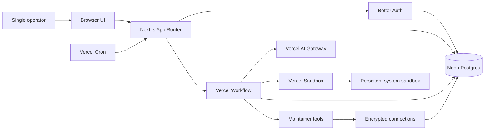
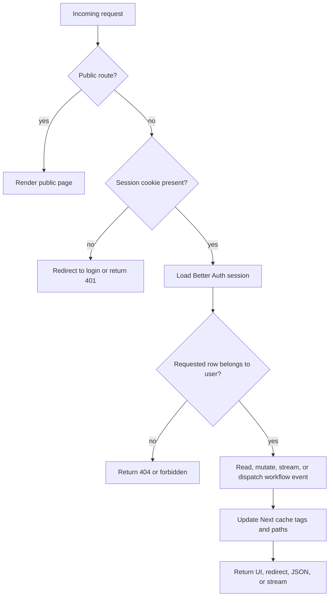
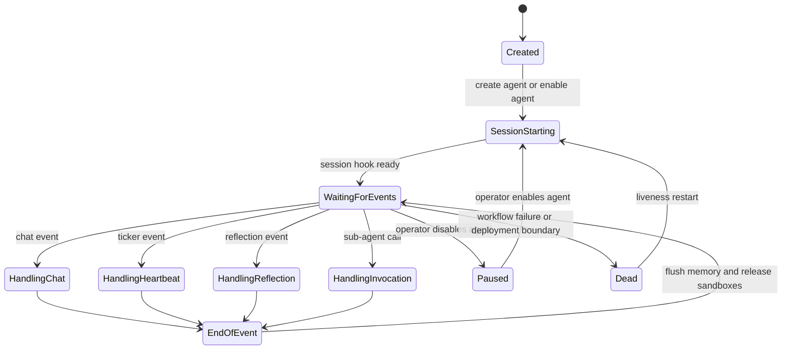
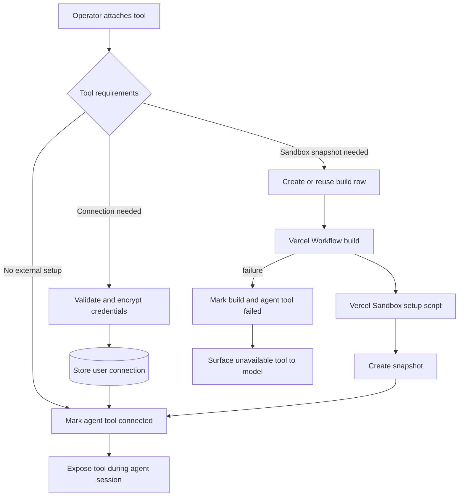
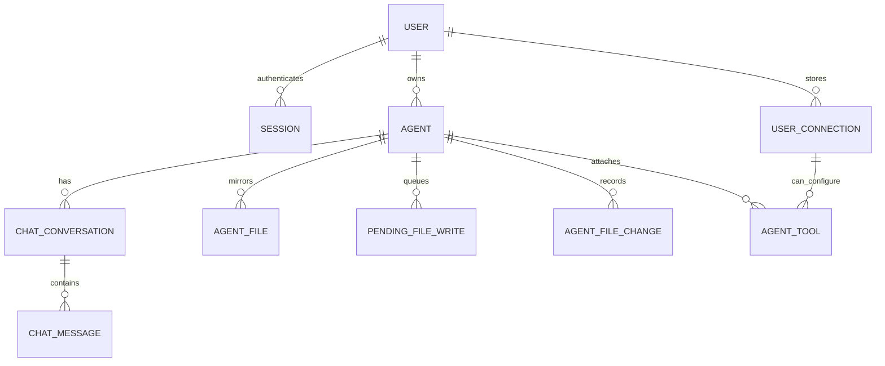

# personal-assistant-agent

Personal AI agent workspace built with Next.js, React, Vercel Workflow, Vercel Sandbox, Better Auth, Neon Postgres, and Drizzle ORM.

The app lets a single authenticated operator create persistent agents, chat with them, configure heartbeat and reflection loops, inspect their memory files, attach tools, and delegate work between agents.

## Architecture

This is a single-tenant personal assistant workspace. The Next.js application is the control plane: it renders the operator UI, enforces the authenticated boundary, owns configuration and CRUD changes, and translates browser events into durable agent workflow events.

Agents are not stateless chat completions. Each agent has:

- a Postgres row that stores configuration, scheduling settings, model choice, the system-sandbox id, and latest workflow run ids;
- persisted chat conversations and UI message parts;
- markdown memory files in a persistent sandbox;
- a mirrored database view of those memory files for fast UI rendering;
- optional external tool attachments and encrypted connection credentials;
- a long-lived workflow session that receives chat, heartbeat, reflection, and sub-agent invocation events.

### System context

The browser only talks to the Next.js app. The app owns authentication, authorization, persistence, and workflow dispatch. Durable execution is delegated to Vercel platform services, while relational state is kept in Neon Postgres.



### Major responsibilities

| Layer | Responsibility | Primary state | Failure boundary |
| --- | --- | --- | --- |
| Browser UI | Render dashboard, agent workspaces, chat, memory files, tool setup, settings, and forms. | Client component state and streamed UI messages. | Can reload safely because durable state is server-owned. |
| Next.js control plane | Authenticate, authorize, validate input, run Server Actions, serve route handlers, revalidate cache tags, and dispatch workflow events. | Request context, Better Auth session, Next cache tags. | Request failure does not corrupt agent memory because writes are persisted or queued before workflow work begins. |
| Neon and Drizzle | Store auth rows, agents, conversations, messages, memory mirrors, pending writes, tools, connections, and sandbox build records. | Postgres tables and generated migrations. | Database is the source of truth for operator-visible state and recovery metadata. |
| Vercel Workflow | Run long-lived agent sessions, ticker workflows, heartbeat/reflection handlers, chat handlers, sub-agent invocations, and tool sandbox builds. | Workflow run ids, hooks, streamed namespaces, durable step state. | Failed sessions can be detected and restarted by liveness checks. |
| Vercel Sandbox | Provide each agent's named persistent memory sandbox plus explicit non-persistent tool-build and tool-runtime environments. | Named sandboxes, resumable sessions, and tool sandbox snapshots. | System sandboxes are stopped after workflow events and transparently resume on the next SDK operation. |
| Tool and connector runtime | Resolve attached tools, decrypt connection credentials, run maintainer tools, and expose sub-agents as callable tools. | `agent_tools`, `user_connections`, tool sandbox snapshots. | Broken tools are surfaced to the model as unavailable instead of crashing the whole session. |

### Request and session flow

Private pages and API routes require a Better Auth session cookie. Unauthenticated browser requests are redirected to `/login`; API handlers return authorization errors. Sign-up is disabled, so local and production use assume a pre-seeded single operator account.

After login, the dashboard reads the operator's agents from Postgres. Creating or editing an agent writes the agent row, validates the selected AI Gateway model, queues any persona or instruction file updates, and starts or updates the agent's workflow session. Pausing an agent stops its session; re-enabling it starts a fresh one if needed.

The important boundary is owner scoping. Every page load, Server Action, and route handler either derives the current user id from the active session or rejects the request. Agent ids are treated as untrusted input until the server confirms ownership.



### Chat flow

Chat is an event dispatched into an existing agent runtime, not a one-off API completion. The route handler persists the user's message before model work starts, then the workflow owns model context assembly, tool availability, streaming, memory writes, and assistant-turn persistence.

```mermaid
sequenceDiagram
  participant B as Browser chat UI
  participant R as Next.js chat route
  participant D as Neon Postgres
  participant S as Agent session workflow
  participant G as AI Gateway model
  participant X as Vercel Sandbox

  B->>R: POST messages and conversation id
  R->>D: Load session, agent, and conversation ownership
  R->>D: Persist latest user message
  R->>S: Resume session hook with chat event and reply token
  R-->>B: Open AI SDK UI message stream
  S->>D: Load agent config, messages, tools, connections, pending writes
  S->>X: Resume system sandbox
  S->>G: Stream model response with memory and tool context
  G-->>S: Model chunks and tool calls
  S-->>R: Write chunks to run namespace keyed by reply token
  R-->>B: Pipe chunks to browser
  S->>D: Persist assistant message and activity
  S->>X: Apply memory writes and read markdown files
  S->>D: Mirror memory files and file changes
  S->>X: Stop named sandbox; SDK persists state for resume
```

The persistence order is deliberate:

1. The user message is inserted before workflow dispatch, so the human side of the conversation is not lost if a workflow run fails.
2. The workflow streams assistant chunks through a per-turn namespace, which allows multiple turns to be separated by reply token even though they share an agent session run.
3. Assistant output is persisted after streaming completes, matching the transcript to what the user saw.
4. Memory mutations are drained at the end of the event, after model/tool work finishes, so file state represents the completed turn.

### Heartbeats, reflection, and liveness

Agents can be configured for recurring heartbeat work and separate reflection work. A session workflow starts a sibling ticker workflow that gates each scheduled tick on completion of the previous event, preventing overlapping heartbeat runs for the same agent.

Vercel Cron calls the liveness endpoint every 15 minutes. When enabled, it checks every active agent's latest workflow run and restarts sessions that died or belong to an older deployment world. This keeps proactive agents recoverable without requiring the operator to open the UI.



The heartbeat design avoids a common automation failure mode: overlapping scheduled runs. The ticker sends one event, waits for an acknowledgement from the session workflow, and only then schedules the next tick. If a session crashes mid-event, the liveness sweeper can reap orphan ticker state and start a replacement session.

### Memory and files

Agent memory lives primarily as files in the agent's persistent system sandbox. The database stores a mirrored view of architecture-defined files so the UI can render logs, memory, and file-change history without reopening the sandbox for every page load. Pending writes created from forms are queued in Postgres and drained by the next workflow event, which keeps protected bootstrap-file mutations ordered with model activity.

There are three memory views:

- **Sandbox files** are the working memory the model-facing file tools interact with during an event.
- **Pending writes** are database rows created by UI edits before the next workflow event applies them to the sandbox.
- **Mirrored files** are architecture-defined database rows copied from the sandbox after an event so the UI can read memory without booting a sandbox.

This means the UI remains fast and database-driven, while the agent still gets a filesystem-native memory model during workflow execution.

### Tools and external connections

Maintainer-shipped tools are registered centrally and can require either user-provided connection credentials, a sandbox snapshot, or neither. Connection credentials are encrypted before they are stored. Tools that need their own runtime setup are built by a separate workflow that creates a sandbox snapshot and marks waiting agent-tool rows as connected when the build succeeds. Sub-agent tools are represented as database attachments and are resolved at runtime with recursion guards.



At runtime, tool resolution happens inside the workflow before the model call. The agent receives only tools that are usable for that turn. Missing credentials, failed sandbox builds, deleted tools, or recursive sub-agent calls are converted into model-visible status instead of process-level crashes.

### Data ownership model

The schema is organized around one authenticated user owning many agents. Agents own conversations, memory mirrors, pending writes, file-change history, and tool attachments. User connections are owned by the user rather than the agent so multiple agents can reuse the same encrypted credential record.



### Caching and UI freshness

Reads that back stable page views are cached with Next.js cache tags. Mutations update or revalidate the affected tags so dashboard counts, agent details, tool lists, conversation sidebars, and memory views refresh after the server-side write. Streaming chat is intentionally not cached; the route opens a live UI message stream and merges workflow output as it arrives.

The result is a split read model:

- normal pages read from Postgres through cached helpers;
- chat reads and writes through live route handlers;
- memory pages read mirrored sandbox files from Postgres;
- workflow handlers read authoritative runtime state and write the next durable snapshot.

### Recovery and consistency strategy

The app favors durable checkpoints over optimistic in-memory state:

- agent rows store the latest session and ticker workflow run ids, which gives the liveness route something concrete to inspect;
- chat user messages are written before workflow dispatch;
- workflow event cleanup runs even when handlers throw, so sandboxes are released and memory mirrors are refreshed when possible;
- orphan ticker workflows are reaped before starting replacement sessions;
- unavailable tools are represented as degraded context for the model instead of hard failures;
- cron can restart sessions after crashes, deploy boundaries, or missing run ids.

This architecture accepts that autonomous agents are long-running and failure-prone. The control plane keeps enough recovery metadata in Postgres to resume, restart, or explain degraded behavior without relying on a browser tab staying open.

### Channel surfaces

The web UI is the primary surface, but agents can also be reached from
external chat platforms. Slack is implemented today on top of the
[Vercel Chat SDK](https://github.com/vercel/chat) (`chat` +
`@chat-adapter/slack`); follow [docs/SLACK_INTEGRATION.md](docs/SLACK_INTEGRATION.md)
for setup. The pipeline is intentionally channel-agnostic — the same
agent session workflow, conversation persistence, memory, and tool
runtime back every surface, so adding Microsoft Teams, Discord, or
WhatsApp is a matter of dropping in the matching adapter.

### Local versus deployed behavior

Local development uses the same Next.js app, Better Auth configuration, Drizzle schema, and remote Neon database. It is good for UI work and database-backed CRUD flows.

Production-like autonomous behavior depends on Vercel-hosted services:

- Vercel Workflow runs long-lived agent sessions, ticker workflows, sub-agent invocations, and tool sandbox builds.
- Vercel Sandbox provides each agent's named persistent memory sandbox, resumable sessions, and explicit non-persistent tool-build/tool-runtime sandboxes.
- Vercel AI Gateway routes model calls and provides the model catalog.
- Vercel Cron drives the liveness sweeper.

Because of those dependencies, local development can render the UI and exercise normal data paths, but autonomous agent execution, sandbox session persistence, and scheduled heartbeat behavior are only fully representative in a Vercel deployment.

## Local development

### Prerequisites

- Node.js 22 or newer
- pnpm
- Access to the shared Neon database URL and app secrets

Install dependencies:

```bash
pnpm install
```

Create `.env.local` in the project root:

```bash
DATABASE_URL=<neon-postgres-connection-string>
BETTER_AUTH_SECRET=<random-auth-secret>
BETTER_AUTH_URL=http://localhost:3000
CONNECTION_ENCRYPTION_KEY=<base64-encoded-32-byte-key>
AI_GATEWAY_API_KEY=<vercel-ai-gateway-key>
```

Optional cron settings:

```bash
CRON_SECRET=<shared-cron-secret>
LIVENESS_CRON_ENABLED=false
```

Optional Slack integration (see [docs/SLACK_INTEGRATION.md](docs/SLACK_INTEGRATION.md)):

```bash
# Multi-workspace OAuth (multi-user safe — recommended)
SLACK_CLIENT_ID=...
SLACK_CLIENT_SECRET=...
SLACK_SIGNING_SECRET=...

# Single-workspace fallback (single operator only)
SLACK_BOT_TOKEN=xoxb-...
SLACK_SIGNING_SECRET=...

SLACK_BOT_USERNAME=assistant

# Optional. Use Redis for concurrency locks/thread subscriptions
# (required for multi-instance deployments).
REDIS_URL=redis://...
```

Generate a local encryption key with:

```bash
openssl rand -base64 32
```

Start the dev server:

```bash
pnpm dev
```

Open [http://localhost:3000](http://localhost:3000).

### Authentication in development

Sign-up is disabled. Use the pre-seeded test user for local login:

```bash
TEST_USER_EMAIL=<provided-email>
TEST_USER_PASSWORD=<provided-password>
```

These values are used as credentials in the login UI; they are not required by the app at runtime unless a seed or test helper needs them.

## Common commands

```bash
pnpm dev          # Start the Next.js dev server
pnpm build        # Create a production build
pnpm build:vercel # Run Drizzle migrations, then create the Vercel build
pnpm start        # Start the production server after building
pnpm check        # Run Ultracite/Biome checks
pnpm fix          # Auto-fix formatting and lint issues
pnpm db:generate  # Generate Drizzle migrations from schema changes
pnpm db:migrate   # Apply generated migrations
pnpm db:migrate:deploy # Baseline-aware deploy migration runner
pnpm db:push      # Push schema changes directly to the database
pnpm db:studio    # Open Drizzle Studio
```

## Database workflow

1. Update `lib/db/schema.ts`.
2. Generate a migration with `pnpm db:generate`.
3. Review the generated SQL in `drizzle/`.
4. Apply it locally with `pnpm db:migrate`.

This repository uses a clean Drizzle baseline:

- `drizzle/0000_baseline.sql` captures the current schema as the first checked-in
  migration.
- Existing databases that already match that schema should **not** run the
  baseline DDL again.
- The deploy runner `pnpm db:migrate:deploy` detects that case, records the
  baseline as already adopted in `drizzle.__drizzle_migrations`, and then runs
  normal Drizzle migrations for every later change.

For short-lived development databases, `pnpm db:push` can apply schema changes directly. If Drizzle Kit prompts for confirmation in a non-interactive shell, run `pnpm drizzle-kit push --force` or use an interactive terminal.

## Vercel + Neon preview branching

This project is designed to run Drizzle migrations during Vercel builds against
the branch-specific `DATABASE_URL` injected by the Neon integration:

- Preview deployments use the matching Neon preview branch (`preview/<git-branch>`).
- Production deployments use the Neon `main` branch.
- Vercel should use `pnpm build:vercel` as the project Build Command so every
  deploy runs `pnpm db:migrate:deploy` before `next build`.
- On the very first deploy to an already-populated database, the deploy runner
  adopts `0000_baseline.sql` into `drizzle.__drizzle_migrations` instead of
  replaying that baseline DDL. All later migrations run normally through
  Drizzle.

### Required Vercel project settings

In Vercel, confirm the linked Neon storage resource is configured like this:

1. Neon Postgres is connected to `Development`, `Preview`, and `Production`.
2. Preview Branching is enabled.
3. Resource readiness is enabled so Vercel waits for the preview branch before
   building.
4. Under `Settings -> Security -> Deployment Retention Policy`, lower the
   `Preview deployments` retention window from the long default so orphaned
   preview deployments do not keep Neon branches around for months.

### Required GitHub Actions configuration

The cleanup workflow in `.github/workflows/neon-preview-cleanup.yml` deletes the
matching Neon preview branch after a PR is merged to `main`, and also when a
remote branch is deleted manually. It requires:

- A repository Actions variable named `NEON_PROJECT_ID`
- A repository Actions secret named `NEON_API_KEY`

`NEON_API_KEY` can be created manually in the Neon console or provisioned via
the Neon GitHub integration.

### Deployment and cutover notes

- Use `pnpm db:migrate:deploy` for deployed environments. Do not use
  `pnpm db:push` in Vercel builds.
- If production is being moved from an older Neon or non-Vercel-managed
  database, verify the production `DATABASE_URL` already points at the
  Vercel-managed Neon project before relying on preview branching and cleanup.
- Deleting a Neon preview branch intentionally breaks old preview deployments
  for that branch, which is expected after the PR is closed or merged.

## Development notes

- This is a single Next.js application, not a monorepo.
- The dev server is the only local service required; the database is remote Neon Postgres.
- Run `pnpm fix` before committing if `pnpm check` reports formatting or lint issues.
- Do not commit `pnpm-workspace.yaml` build allow-list overrides; they can break production builds for this app.
- Keep platform-specific behavior in mind when debugging locally: workflow runs, sandboxes, and autonomous agent loops are only fully available in Vercel.

## v0 project

This repository is linked to a v0 project. You can continue developing by visiting:

[Continue working on v0](https://v0.app/chat/projects/prj_k8JEeBeWTnlZ0FQy7WV1rNqr5EgU)
