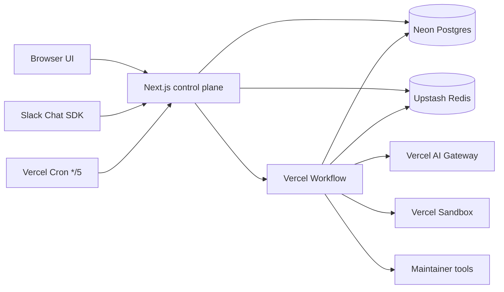
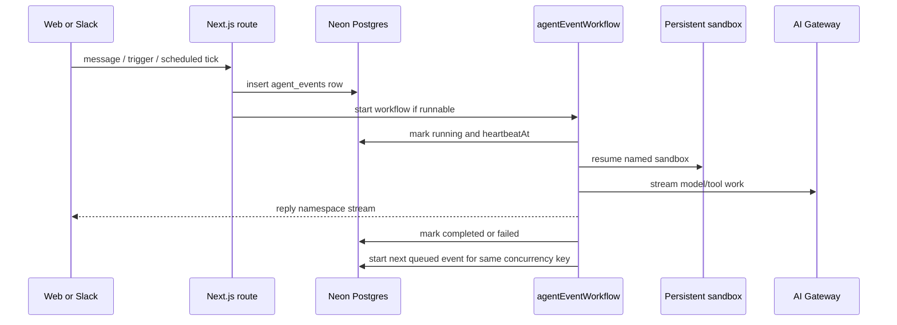

# personal-assistant-agent

Personal AI agent workspace built with Next.js, React, Vercel Workflow,
Vercel Sandbox, Better Auth, Neon Postgres, Drizzle ORM, Slack Chat SDK,
and Upstash Redis.

The app lets an authenticated operator create persistent agents, chat with
them, configure heartbeat and dreaming loops, inspect sandbox memory files,
attach tools, route Slack messages, and delegate work between agents.

## Architecture

This is a single Next.js application. Next.js is the control plane: it
authenticates requests, owns CRUD/configuration, persists chat messages,
and turns every inbound action into an `agent_events` row.

Agents no longer depend on a resident per-agent workflow. Runtime work is
event-scoped:

- `agent_events` is the durable ledger for chat, Slack, heartbeat, dreaming,
  and sub-agent invocation work.
- Each event is executed by one Vercel Workflow run.
- Multiple workflow runs for the same agent may run concurrently.
- `concurrency_key` is used only where order matters, such as the same Slack
  thread or the same scheduled heartbeat/dreaming bucket.
- The agent's persistent Vercel Sandbox is the canonical memory/filesystem.
- Redis is a cache and coordination layer, not the source of truth.



## Event Flow

Browser chat, Slack, manual triggers, scheduler ticks, and sub-agent calls all
use the same enqueue path:

1. Validate user/agent ownership.
2. Persist the user-visible input when applicable.
3. Insert or reuse an `agent_events` row by `idempotency_key`.
4. Try to start the event immediately unless another active event has the same
   `concurrency_key`.
5. Stream output from the event workflow namespace.



## Scheduling And Liveness

Vercel Cron calls `/api/cron/liveness` every 5 minutes. That single endpoint:

- acquires a Redis lock so only one scheduler runs at a time;
- creates due heartbeat and dreaming events;
- starts queued events;
- requeues expired `starting` events;
- inspects `running` events via workflow status and `heartbeatAt`.

Long-running realtime events are expected. A Slack-triggered event can run for
30 minutes without being treated as dead; recovery is based on stale
`heartbeatAt` or terminal workflow state, not wall-clock duration alone.

## Slack

Slack uses the Vercel Chat SDK with `@chat-adapter/slack`.

- Chat SDK handler concurrency is only ingest protection.
- Canonical idempotency and queueing live in `agent_events`.
- Slack idempotency key:
  `slack:{teamId}:{channelId}:{messageTs}:{agentId}`.
- Slack thread concurrency key:
  `slack:{teamId}:{channelId}:{threadTs}:{agentId}`.
- A queued same-thread message gets a short Slack acknowledgement.
- `slackStreamForwarderWorkflow` reconstructs the Slack thread from primitive
  ids and passes the event reply stream to `thread.post(...)`.

## Memory And Files

The persistent system sandbox is the source of truth. UI-authored bootstrap
files are written directly into the sandbox:

- `AGENTS.md`
- `IDENTITY.md`
- `SOUL.md`
- `USER.md`

The agent's own file tools still refuse to write user-owned bootstrap files.
`USER.md` remains agent-maintained when durable user facts are learned.

Redis caches common markdown files for fast UI reads. If Redis is empty or
stale, server reads fall back to the sandbox.

## Data Model

Key tables:

- `agent`: configuration, model, scheduling settings, and system sandbox name.
- `agent_events`: durable event ledger and retry/liveness metadata.
- `chat_conversation` and `chat_message`: browser and channel transcripts.
- `agent_tools`: attached maintainer tools and sub-agent tools.
- `channel_installations`, `agent_channel_bindings`,
  `channel_thread_conversations`: Slack routing and installation state.

## Local Development

### Prerequisites

- Node.js 22 or newer
- pnpm
- Access to the shared Neon database URL and app secrets

Install dependencies:

```bash
pnpm install
```

Create `.env.local` in the project root:

```bash
DATABASE_URL=<neon-postgres-connection-string>
BETTER_AUTH_SECRET=<random-auth-secret>
BETTER_AUTH_URL=http://localhost:3000
CONNECTION_ENCRYPTION_KEY=<base64-encoded-32-byte-key>
AI_GATEWAY_API_KEY=<vercel-ai-gateway-key>
```

Optional scheduler and Redis settings:

```bash
CRON_SECRET=<shared-cron-secret>
AGENT_SCHEDULER_CRON_ENABLED=true
UPSTASH_REDIS_REST_URL=...
UPSTASH_REDIS_REST_TOKEN=...
```

Optional Slack integration:

```bash
SLACK_CLIENT_ID=...
SLACK_CLIENT_SECRET=...
SLACK_SIGNING_SECRET=...
SLACK_BOT_USERNAME=assistant

# Optional Chat SDK state backend for locks/subscriptions.
REDIS_URL=redis://...
```

Generate a local encryption key with:

```bash
openssl rand -base64 32
```

Start the dev server:

```bash
pnpm dev
```

Open [http://localhost:3000](http://localhost:3000).

## Common Commands

```bash
pnpm dev          # Start the Next.js dev server
pnpm build        # Create a production build
pnpm build:vercel # Run Drizzle migrations, then create the Vercel build
pnpm start        # Start the production server after building
pnpm check        # Run Ultracite/Biome checks
pnpm fix          # Auto-fix formatting and lint issues
pnpm db:generate  # Generate Drizzle migrations from schema changes
pnpm db:migrate   # Apply generated migrations
pnpm db:push      # Push schema changes directly to the database
pnpm db:studio    # Open Drizzle Studio
```

## Development Notes

- This is a single Next.js application, not a monorepo.
- The dev server is the only local service required; the database is remote
  Neon Postgres.
- Sign-up is disabled; local login uses the pre-seeded test user.
- Run `pnpm check` and `pnpm exec tsc --noEmit` before committing.
- Workflow runs, persistent sandbox behavior, cron, and Slack streaming are
  only fully representative in a Vercel deployment.
