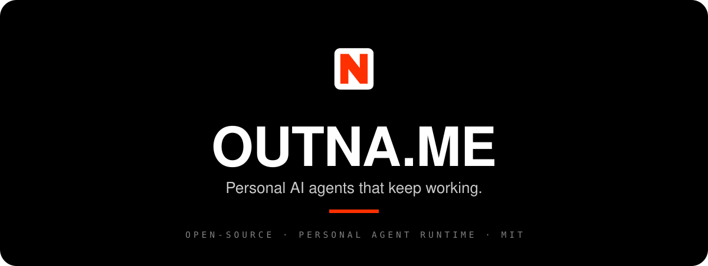
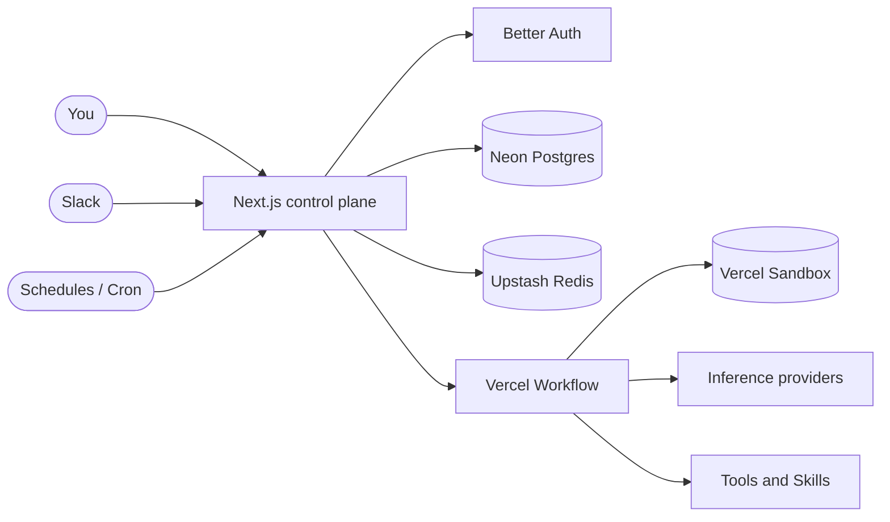

<div align="center">



<br/>

**Personal AI agents that remember, learn, and keep working — even when you're not there.**

[](LICENSE)
[](https://github.com/TommyBez/outname/stargazers)
[](https://nextjs.org)
[](https://react.dev)
[](https://www.typescriptlang.org)
[](https://turbo.build)
[](CONTRIBUTING.md)

**[Website](https://outna.me)** · **[Quick start](#-quick-start)** · **[How it works](#-how-it-works)** · **[Docs](docs/index.md)** · **[Contributing](CONTRIBUTING.md)** · **[X / Twitter](https://x.com/OutnameBot)**

</div>

---

## What is outname?

A chatbot answers when you ask. An **outname** agent keeps working when you don't.

**outname** (OUTNA.ME) is an open-source runtime for **personal AI agents** that
own a slice of your work over time. Each agent has its own readable memory, runs
on a schedule, calls real tools, talks across channels, and can hand work off to
other agents. Every run sharpens the next.

> _They remember. They learn. They call other agents. It runs while you sleep. It learns while it runs._

It's a production-grade [Turborepo](https://turbo.build) monorepo built on
Next.js, Vercel Workflow, Vercel Sandbox, Neon Postgres, and a model-agnostic
inference layer — so you can self-host the whole thing.

## Table of contents

- [Why outname](#why-outname)
- [Features](#features)
- [How it works](#-how-it-works)
- [Architecture](#-architecture)
- [Tech stack](#-tech-stack)
- [Project structure](#-project-structure)
- [Quick start](#-quick-start)
- [Deploy on Vercel](#-deploy-on-vercel)
- [Configuration](#-configuration)
- [Common commands](#-common-commands)
- [Documentation](#-documentation)
- [Contributing](#-contributing)
- [License](#-license)

## Why outname

Most agents are stateless: they start cold, do one thing, and forget. Useful for
a question, useless for ongoing work that needs continuity.

outname is built around the opposite idea — **agents that accumulate context and
act on their own initiative**:

| Stateless chatbot                              | An outname agent                                                  |
| ---------------------------------------------- | ----------------------------------------------------------------- |
| ❌ Starts from zero every conversation          | ✅ Keeps readable memory it appends to over time                   |
| ❌ Only runs when you prompt it                 | ✅ Wakes on a schedule and works unprompted                        |
| ❌ One model, one vendor                        | ✅ Model-agnostic — bring your own provider and keys               |
| ❌ Lives in one chat window                     | ✅ Same agent across in-app chat and Slack                         |
| ❌ Does everything itself, opaquely             | ✅ Delegates to sub-agents, each a traced run                      |
| ❌ Unbounded, unscoped tool access              | ✅ Typed tools, per-agent scope, and spend budgets                 |

## Features

- 🧠 **Persistent memory** — Each agent keeps human-readable markdown
  (`MEMORY.md`, `TASKS.md`, `DREAMS.md`, `GOALS.md`) in its own sandbox. It
  appends its own notes; you can read or edit them anytime.
- ❤️ **Heartbeat** — Scheduled, unprompted runs. The agent wakes on a cron or
  interval, inspects its memory and channels, and acts — no human in the loop.
- 💤 **Dreaming** — Dedicated reflection passes that improve long-running memory:
  the agent reviews its own notes, anticipates patterns, and self-evaluates.
- 🪆 **Sub-agents** — Agents delegate to other agents. Each call is its own
  traced run; the parent can wait for the result or fire-and-forget.
- 🧰 **Tools** — Typed, rate-limited, and scoped per agent. An agent only ever
  calls what you bind to it.
- 📡 **Channels** — One agent, every surface. In-app chat and Slack today, built
  on the Vercel Chat SDK so new surfaces can be added.
- 🧩 **Agent Skills** — Installable capability packages that run in a dedicated,
  persistent Skill Sandbox, isolated from the agent's memory filesystem.
- 💸 **Budgets** — Per-agent spend guardrails with estimated and actual cost
  tracking, so autonomous work can't run away.
- 📦 **Sandboxed execution** — Every agent owns a persistent Vercel Sandbox as
  its canonical filesystem; durable work runs as event-driven Vercel Workflows.
- 🔌 **Model-agnostic** — Bring your own keys for **Vercel AI Gateway**, **LLM
  Gateway**, or **OpenRouter**, and choose the provider and model per agent.

## 🫀 How it works

You create an agent in the web app, give it memory and a schedule, attach the
tools and channels it should use — then let it run. It works on its own and
reports back in its **Timeline**.

Here's one agent's autonomous day — schedules firing, channels lighting up,
sub-agents returning, memory growing:

| Time  | Event     | What happened                              |
| ----- | --------- | ------------------------------------------ |
| 06:00 | Schedule  | Daily triage run queued                    |
| 06:00 | Slack     | 14 threads scanned · 2 flagged             |
| 06:01 | Memory    | Noted: skip auto-summary on Sundays        |
| 09:14 | Heartbeat | Calendar conflict spotted · draft prepared |
| 09:14 | Calendar  | Proposed Tue 15:00 → Wed 10:00             |
| 11:02 | Sub-agent | Delegated to research-synthesizer (4.2s)   |
| 11:02 | Memory    | Noted: user prefers "Tomas" in replies     |
| 14:00 | Schedule  | Weekly digest run queued                   |
| 14:01 | Email     | 5 threads summarized · digest drafted      |
| 18:00 | Email     | Weekly digest sent · 0 follow-ups          |

**21 unprompted runs · +8 memory entries · 0 questions asked.** You open the app
in the morning and read what it did while you slept.

Under the hood, work splits into two paths:

- **Realtime turns** (in-app chat, Slack) run directly in the Next.js Node
  runtime via the AI SDK `ToolLoopAgent`, backed by the app-owned chat
  transcript.
- **Autonomous turns** (heartbeat, dreaming, sub-agent invocation) are durable:
  they create `agent_events` rows and run as event-driven **Vercel Workflows**,
  with each agent's files living in its own **Vercel Sandbox**.

## 🏗 Architecture

A single Next.js control plane orchestrates everything; durable agent work runs
on Vercel Workflow against per-agent Vercel Sandboxes.



See **[docs/index.md](docs/index.md)** for generated, feature-focused docs,
including runtime boundaries, event flow, tools, channels, and data ownership.

## 🧱 Tech stack

| Layer            | Technology                                                       |
| ---------------- | --------------------------------------------------------------- |
| App & UI         | Next.js 16 (App Router), React 19, Tailwind CSS, Radix / shadcn |
| Language         | TypeScript                                                       |
| Monorepo         | Turborepo + pnpm                                                 |
| Auth             | Better Auth (email one-time codes)                              |
| Data             | Neon Postgres + Drizzle ORM                                      |
| Cache & coord.   | Upstash Redis                                                    |
| Agent runtime    | AI SDK (`ToolLoopAgent`) + Vercel Workflow                       |
| Agent filesystem | Vercel Sandbox                                                   |
| Inference        | Vercel AI Gateway · LLM Gateway · OpenRouter                     |
| Channels         | Vercel Chat SDK (Slack)                                          |
| Email            | Resend + React Email                                             |
| Video            | Remotion                                                         |
| Quality          | Biome / Ultracite, Vitest                                       |

## 📂 Project structure

```text
outname/
├─ apps/
│  ├─ app/      # Control plane: agents, chat, configuration   (:3000)
│  ├─ api/      # API surface + cron / scheduler ingress       (:3001)
│  ├─ web/      # Public marketing site + blog                 (:3002)
│  ├─ email/    # React Email preview (local-only)             (:3004)
│  └─ video/    # Remotion Studio (local-only)                 (:3005)
├─ packages/
│  ├─ ai/       # Agent runtime, chat, AI elements
│  ├─ auth/     # Better Auth configuration
│  ├─ db/       # Drizzle schema + Neon client
│  ├─ email/    # Email templates
│  ├─ shared/   # Shared domain, marketing, and server utilities
│  ├─ ui/       # Design system (Radix + shadcn)
│  └─ workflow/ # Workflow helpers
└─ docs/        # Generated feature index, feature notes, and ADRs
```

## 🚀 Quick start

### Prerequisites

- **Node.js 24+** and **pnpm 10+**
- Access to the shared Neon database and application secrets (the database is
  remote — no local Postgres required)

### Setup

```bash
git clone https://github.com/TommyBez/outname.git
cd outname
pnpm install
cp .env.example .env.local   # then fill in the values
pnpm dev:app                 # http://localhost:3000
```

Other workspaces: `pnpm dev:web` (`:3002`), `pnpm dev:api` (`:3001`),
`pnpm dev:email` (`:3004`), and `pnpm dev:video` (`:3005`).

> **Signing in:** Public sign-up is disabled. Accounts are provisioned from the
> waitlist and sign in with one-time codes sent by email. In development, use a
> provisioned address (e.g. `TEST_USER_EMAIL`) and request an OTP from the login
> page. See [AGENTS.md](AGENTS.md) for the full dev sign-in flow.

## ▲ Deploy on Vercel

[](https://vercel.com/new/clone?repository-url=https%3A%2F%2Fgithub.com%2FTommyBez%2Foutname)

1. Fork this repository and create a new Vercel project from the fork.
2. Set the project runtime to **Node.js 24** or newer.
3. Add the environment variables from `.env.example`.
4. Set `BETTER_AUTH_URL` to the production application URL.
5. Create Vercel projects for the deployable apps: `apps/web`, `apps/app`, and
   `apps/api`. `apps/email` and `apps/video` are local-only.
6. Configure `VERCEL_API_PROJECT_ID`, `VERCEL_APP_PROJECT_ID`, and
   `VERCEL_WEB_PROJECT_ID` so related-project wiring can be resolved from
   project IDs.
7. For the API project, keep the `/api/cron/liveness` cron and run migrations
   before deployment.

## ⚙️ Configuration

### Minimum environment variables

```bash
DATABASE_URL=
BETTER_AUTH_SECRET=
BETTER_AUTH_URL=
BETTER_AUTH_TRUSTED_ORIGINS=
AUTH_COOKIE_DOMAIN=
CONNECTION_ENCRYPTION_KEY=
RESEND_API_KEY=
AUTH_FROM_EMAIL=
AUTH_REPLY_TO=
VERCEL_API_PROJECT_ID=
VERCEL_APP_PROJECT_ID=
VERCEL_WEB_PROJECT_ID=
```

### Common optional integrations

| Integration            | Variables                                                          |
| ---------------------- | ----------------------------------------------------------------- |
| Slack                  | `SLACK_CLIENT_ID`, `SLACK_CLIENT_SECRET`, `SLACK_SIGNING_SECRET`   |
| Redis (Upstash / KV)   | `KV_REST_API_URL`, `KV_REST_API_TOKEN`                            |
| Waitlist email         | `WAITLIST_FROM_EMAIL`, `WAITLIST_REPLY_TO`, `WAITLIST_ADMIN_EMAIL` |
| Cron hardening         | `CRON_SECRET`                                                      |

Cross-project public URLs are derived in each app's `next.config.ts` from Vercel
related-project metadata; outside Vercel they fall back to localhost origins.

## 🛠 Common commands

```bash
pnpm dev          # Run the default dev pipeline
pnpm dev:app      # Control plane          (:3000)
pnpm dev:api      # API                    (:3001)
pnpm dev:web      # Public site            (:3002)
pnpm dev:email    # React Email preview    (:3004)
pnpm dev:video    # Remotion Studio        (:3005)

pnpm build        # Build all workspaces
pnpm lint         # Lint (Ultracite / Biome)
pnpm typecheck    # Type-check
pnpm verify       # Docs check + build + typecheck + lint + react-doctor
pnpm fix          # Auto-fix lint/format issues
pnpm docs:index   # Regenerate docs indexes
pnpm docs:check   # Validate docs indexes and non-index markdown line limit

pnpm db:generate  # Generate Drizzle migrations
pnpm db:migrate   # Apply migrations
pnpm db:studio    # Open Drizzle Studio
```

## 📚 Documentation

Start at **[docs/index.md](docs/index.md)**. Feature docs live in
`docs/<feature>/`, stay under 30 lines per non-index markdown file, and are
linked through generated indexes.

Other project guidance:

- **[AGENTS.md](AGENTS.md)**: non-inferable rules for coding agents.
- **[CONTRIBUTING.md](CONTRIBUTING.md)**: contributor workflow.
- **[SECURITY.md](SECURITY.md)**: vulnerability disclosure.
- **[CODE_OF_CONDUCT.md](CODE_OF_CONDUCT.md)**: community expectations.

## 🤝 Contributing

Contributions are welcome! Please read **[CONTRIBUTING.md](CONTRIBUTING.md)**
before opening a pull request. For substantive changes, update user-facing
documentation alongside the code so the repository stays self-serve. Run
`pnpm verify` before pushing.

Found a security issue? Please follow the process in
**[SECURITY.md](SECURITY.md)** rather than opening a public issue.

## 📄 License

Released under the **[MIT License](LICENSE)**.

<div align="center">
<br/>

**[outna.me](https://outna.me)** — Agents that keep working.

</div>
