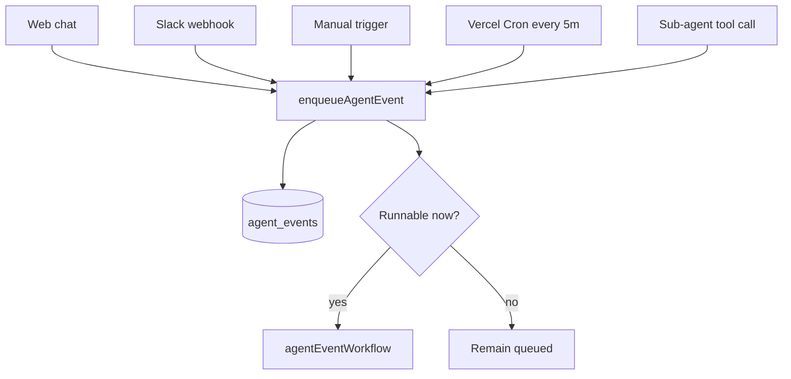

# Architecture

## Runtime Model

Agent runtime is event-based. There is no per-agent workflow that stays alive
waiting for hooks. Every unit of work is represented by one row in
`agent_events` and, when started, one Vercel Workflow run.

Event types:

- `chat`
- `heartbeat`
- `dreaming`
- `invocation`

Event statuses:

- `queued`
- `starting`
- `running`
- `completed`
- `failed`
- `cancelled`

`idempotency_key` prevents duplicate channel/scheduler work.
`concurrency_key` is nullable and only used where ordering matters. Different
keys for the same agent can run concurrently.

## Ingress



Realtime ingress tries to start immediately. Cron is the fallback and scheduler.

## Workflow

`agentEventWorkflow(eventId)`:

1. Reads the `agent_events` row.
2. Marks it `running` and updates `heartbeat_at`.
3. Starts a publisher workflow when the source is Slack.
4. Dispatches to the existing chat, heartbeat/dreaming, or invocation handler.
5. Marks the event terminal.
6. Cleans up per-run tool sandboxes.
7. Refreshes the Redis file cache best-effort.
8. Starts the next queued event with the same `concurrency_key`.

The persistent system sandbox is not stopped at the end of every event. Vercel
Sandbox beta persistence/autoresume handles idle compute. A future cleanup may
stop idle sandboxes only after checking there are no `starting` or `running`
events for that agent.

## Scheduler And Liveness

`/api/cron/liveness` is both scheduler and liveness sweeper. It runs every
5 minutes and uses a Redis lock.

Responsibilities:

- enqueue due heartbeat events;
- enqueue due dreaming events;
- start queued events;
- requeue expired `starting` events whose workflow is not alive;
- mark terminal workflow runs reflected in `running` events;
- fail only stale `running` events whose `heartbeat_at` exceeds the long
  threshold.

Long Slack tasks are valid. Runtime age alone is not failure.

## Slack

Slack messages are persisted as chat turns, then enqueued with Slack-specific
dedupe and ordering:

- idempotency: `slack:{teamId}:{channelId}:{messageTs}:{agentId}`;
- ordering: `slack:{teamId}:{channelId}:{threadTs}:{agentId}`.

If the same Slack thread already has an active event, the new event remains
`queued` and Slack receives a short acknowledgement.

Streaming is handled by `slackStreamForwarderWorkflow`. It stores only primitive
Slack ids in the event payload, reconstructs the thread with Chat SDK outside
the webhook, and passes the workflow reply stream to `thread.post(...)`.

## Files

The named Vercel Sandbox is the canonical agent filesystem.

- UI bootstrap edits write directly to the sandbox.
- Legacy database file mirrors and pending-write queues are gone.
- Redis caches common markdown files for UI reads.
- If cache and sandbox disagree, sandbox wins.

The agent's own file tools still block writes to user-owned bootstrap files.

## Operational Checks

Run:

```bash
pnpm check
pnpm exec tsc --noEmit
```

For deployed verification, also exercise:

- web chat streaming;
- Slack same-thread queueing and streaming;
- manual heartbeat/dreaming trigger;
- cron-created heartbeat/dreaming events;
- sandbox file cache fallback by clearing Redis.
