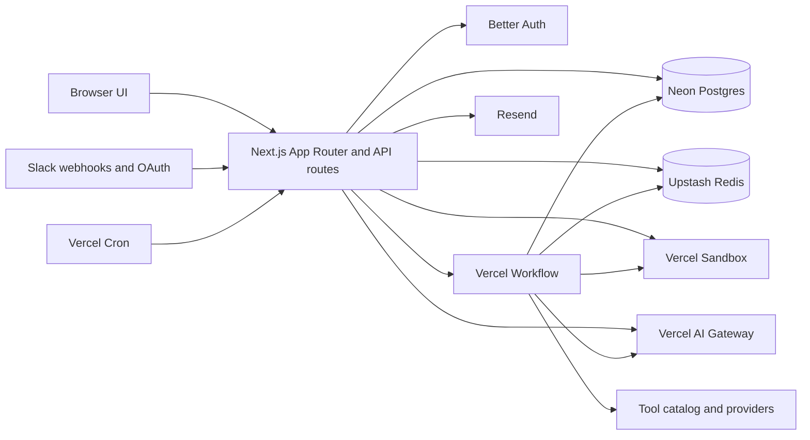
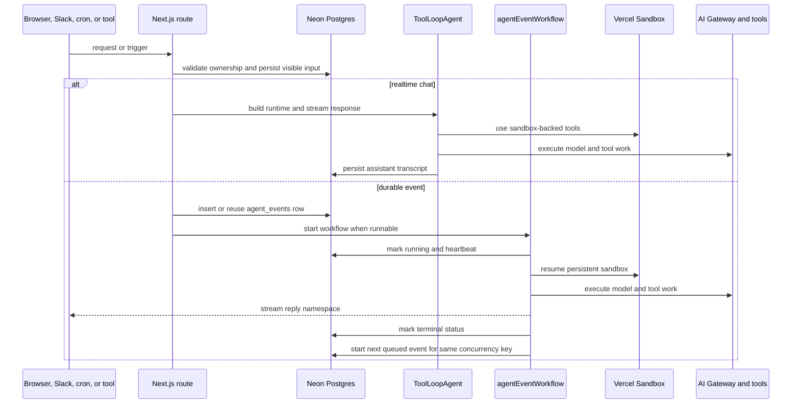

# Architecture

This document describes the current architecture of `outname`. The application
is a single Next.js control plane
that orchestrates event-driven agent work through Vercel Workflow, persists
application state in Neon Postgres, and keeps each agent's filesystem in a
persistent Vercel Sandbox.

## System overview

## Runtime boundaries

### Next.js control plane

The Next.js application owns routing, authentication, configuration screens,
browser chat APIs, Slack installation endpoints, waitlist endpoints, and
scheduler ingress.

Key files:

- `app/` for pages and route handlers
- `proxy.ts` for auth and waitlist gating
- `auth/server/auth.ts` for Better Auth configuration
- `app/api/cron/liveness/route.ts` for scheduler ingress

### Agent runtime

Agent work is run-scoped. There is no always-on per-agent process.

Realtime chat turns from the web app and Slack run directly in the Next.js Node
runtime through AI SDK `ToolLoopAgent`. Their visible state is the
`chat_message` transcript. They do not create durable `agent_events` rows.

Autonomous or long-running work remains workflow-backed. Heartbeat, dreaming,
and sub-agent invocation create `agent_events` rows and run through Vercel
Workflow.

Core responsibilities:

- building a serializable `AgentRuntimeSpec` shared by durable and realtime
  adapters;
- dispatching realtime `ToolLoopAgent` chat turns;
- enqueueing and deduplicating durable events;
- dispatching durable handlers for heartbeat, dreaming, and invocation;
- managing per-event reply streams;
- cleaning up ephemeral resources after each run;
- starting the next queued event for a matching concurrency key.

Key files:

- `agent-runtime/server/agent-events.ts`
- `agent-runtime/server/agent-event-store.ts`
- `agent-runtime/server/runtime-spec.ts`
- `agent-runtime/server/realtime-chat-runner.ts`
- `agent-runtime/workflows/events/workflow.ts`
- `agent-runtime/workflows/session/handlers/*`

### Agent filesystem

Each agent has a named persistent Vercel Sandbox. The sandbox is the canonical
filesystem for bootstrap files and durable agent-authored files.

- UI-authored bootstrap edits write directly into the sandbox.
- Redis only caches selected file reads for faster UI access.
- If Redis and sandbox contents disagree, the sandbox is authoritative.

## Event model

Event types:

- `heartbeat`
- `dreaming`
- `invocation`

Event statuses:

- `queued`
- `starting`
- `running`
- `completed`
- `failed`
- `cancelled`

`idempotency_key` prevents duplicate durable work for retried or repeated
autonomous ingress. `concurrency_key` is used only where durable ordering
matters, such as scheduled buckets for the same agent. Realtime channel
idempotency is handled at the `chat_message` layer.

## Request and event flow

## Scheduler and liveness

`/api/cron/liveness` is both scheduler and liveness sweeper. `vercel.json`
configures it to run every five minutes in deployed environments.

The scheduler:

- acquires a Redis lock so only one sweep runs at a time;
- enqueues due heartbeat and dreaming events;
- starts queued events that are now runnable;
- requeues expired `starting` events whose workflow never came up;
- inspects `running` events and reconciles them with workflow status.

Long-running durable events are valid. Failure detection depends on stale
heartbeat data or terminal workflow state, not just elapsed runtime. Realtime
channel turns are best-effort request/background work with transcript-level
deduplication.

## State ownership

| Concern | Source of truth | Notes |
| --- | --- | --- |
| Users, sessions, agents, tools, conversations | Neon Postgres | Stored through Drizzle ORM and Better Auth. |
| Agent event ledger | Neon Postgres | `agent_events` drives durable orchestration and recovery for heartbeat, dreaming, and invocation. |
| Agent filesystem and bootstrap files | Vercel Sandbox | Persistent per-agent filesystem. |
| Cache and distributed coordination | Upstash Redis | Used for locks, scheduling, and cached file reads. |
| Slack thread state | Postgres plus Redis | Installations live in Postgres; Chat SDK locks, queue, dedupe, subscriptions, and ephemeral state require Redis. |

## Key data model

The main application tables are:

- `agent` for configuration, model selection, schedules, and sandbox identity;
- `agent_events` for durable runtime orchestration and retries;
- `chat_conversation` and `chat_message` for transcripts;
- `agent_tools` for tool attachments and sub-agent wiring;
- `channel_installations`, `agent_channel_bindings`, and
  `channel_thread_conversations` for Slack integration;
- `user_connections` for user-provided provider credentials;
- `waitlist_entry` for public waitlist capture.

## External integrations

| Service | Role in the system | Primary files |
| --- | --- | --- |
| Better Auth | Authentication and admin roles | `auth/server/auth.ts`, `app/api/auth/[...all]/route.ts` |
| Neon Postgres | Primary relational database | `shared/db/index.ts`, `shared/db/schema/*` |
| Vercel Workflow | Durable heartbeat, dreaming, and invocation execution | `next.config.ts`, `agent-runtime/workflows/events/workflow.ts` |
| Vercel Sandbox | Persistent agent filesystem and tool execution | `agent-runtime/server/agent-sandbox.ts`, `tools/sandbox-runtime/*` |
| Upstash Redis | Locks, cache, and scheduling coordination | `agent-runtime/server/redis-lock.ts`, `agent-runtime/server/file-cache.ts` |
| Slack Chat SDK | Slack ingress, routing, and streaming replies | `channels/slack/server/*`, `app/api/channels/slack/*` |
| Resend | Waitlist confirmation email delivery | `waitlist/server/email.ts` |

## Repository layout

| Path | Purpose |
| --- | --- |
| `app/` | App Router pages and HTTP endpoints |
| `agent-runtime/` | Event queue, scheduler, workflows, and runtime handlers |
| `agents/` | Agent-facing UI and server helpers |
| `auth/` | Auth configuration and access control |
| `channels/` | Slack adapters and channel dispatching |
| `chat/` | Conversation persistence and chat helpers |
| `connections/` | User-managed provider credentials |
| `shared/` | Shared database, metadata, and server utilities |
| `tools/` | Tool catalog, providers, and sandbox execution helpers |
| `waitlist/` | Public waitlist flow and email integration |

## Local versus deployed behavior

Local development uses the same Next.js application and database schema as the
deployed app. For most product work, the local environment is enough. Vercel is
mainly useful when you want to exercise hosted or scheduled behavior such as:

- workflow execution;
- persistent sandbox lifecycle;
- scheduler execution through Vercel Cron;
- Slack ingress, Chat SDK queueing, and background streaming behavior.
