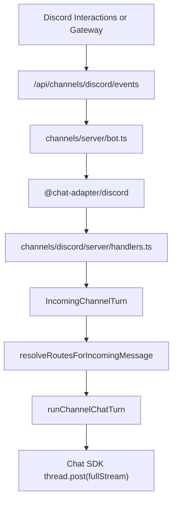

# Discord Integration

Discord is a realtime ingress channel for agents. It shares the same lazy
multi-adapter Vercel Chat SDK `Chat` instance used by Slack, plus the same
Redis-backed locks, queues, dedupe, subscriptions, and `runChannelChatTurn`
dispatch path.

## Runtime Flow



The shared events route is dynamic: `/api/channels/[channel]/events`. Discord
Gateway is the only Discord-specific public route:
`/api/channels/discord/gateway`.

## Discord Developer Portal Setup

Create or open a Discord application, then configure:

- Bot token: store as `DISCORD_BOT_TOKEN`.
- Public key: store as `DISCORD_PUBLIC_KEY`.
- Application id: store as `DISCORD_APPLICATION_ID`.
- OAuth client secret: store as `DISCORD_CLIENT_SECRET`.
- OAuth redirect URL:
  `/api/channels/discord/oauth/callback`.
- Interactions endpoint URL:
  `/api/channels/discord/events`.
- Bot scopes: `identify bot applications.commands`.
- Message Content Intent: enabled if mention/message text should be available
  through Gateway events.

`DISCORD_BOT_PERMISSIONS` can override the install permission integer. The
default grants view channel, send messages, read history, create public threads,
and send in threads.

## Environment Variables

```bash
CHANNEL_BOT_USERNAME=assistant
DISCORD_BOT_USERNAME=assistant
DISCORD_APPLICATION_ID=...
DISCORD_BOT_TOKEN=...
DISCORD_PUBLIC_KEY=...
DISCORD_CLIENT_SECRET=...
DISCORD_MENTION_ROLE_IDS=...
DISCORD_BOT_PERMISSIONS=...
REDIS_URL=redis://...
CRON_SECRET=...
```

`CHANNEL_BOT_USERNAME` is the global Chat SDK username. Discord can override it
with `DISCORD_BOT_USERNAME`.

## OAuth And Linking

The Discord install flow is served by `/api/channels/discord/install`. The
callback validates signed state against the current app session, exchanges the
OAuth code, reads `/users/@me`, verifies bot access to the selected guild, and
registers `/agent`.

No Discord access or refresh token is stored. The callback stores two
installation rows:

- `guild:{guildId}` for guild routing and audit metadata.
- `user:{discordUserId}` for explicit DM routing.

`installerDiscordUserId` on the guild row is audit-only. DM routing always uses
the `user:{discordUserId}` row plus an explicit agent binding.

Disconnecting a guild removes the guild row. The user-link row is removed only
when that OUTNA.ME user has no remaining Discord guild installs for the same
Discord user.

## Message Behavior

- Guild mention: the Discord adapter creates or resolves the thread; the app
  subscribes and dispatches the normalized turn.
- Subscribed thread reply: the existing subscribed thread is reused.
- Direct message: routes only through `user:{discordUserId}` and an explicit DM
  binding.
- No binding: the app posts setup guidance and does not create app-owned
  threads.

Provider history import is best effort through `thread.allMessages`; unsupported
history fetches fall back to an empty list.

## Slash Command

`/agent` is registered per guild with a required `prompt` option. Registration
is idempotent: the app reads guild commands and patches only when the expected
schema/version changes.

Thread policy:

- Top-level guild channel with a valid binding: post a starter response, create
  one dedicated Discord thread via REST, subscribe it, then run the agent in
  `after()`.
- Existing Discord thread: reuse that thread and subscribe it.
- DM: treat as a DM and do not create a thread.
- Missing binding: post setup guidance and stop.

Concurrent Discord retries use a cross-instance Redis guard:
`discord:slash:lock:{interactionId}` with a 30 second TTL. Chat SDK dedupe and
Postgres message idempotency remain the second line of defense.

Thread creation uses direct Discord REST because `createDiscordThread` is a
protected adapter method. The app never calls protected adapter APIs.

## Gateway

Vercel Cron calls `/api/channels/discord/gateway` every 4 minutes. The route
fails closed with `401` when `CRON_SECRET` is missing or the authorization
header does not match.

The listener runs for 255 seconds with `AbortSignal.timeout(265_000)`. A small
overlap between cron ticks is intentional; Chat SDK dedupe and deterministic
Postgres message keys absorb duplicate forwarded events.

Sub-hour cron and 300 second function duration require an appropriate Vercel
plan and Fluid Compute. Slash commands over HTTP continue to work without the
Gateway cron.

## Troubleshooting

- `401` on Gateway: set `CRON_SECRET` and let Vercel send the cron bearer
  header.
- OAuth callback says missing `guild_id`: install the bot into a server, not
  only as a user authorization.
- `/agent` says no binding: add a Discord binding in the agent Configure /
  Integrations section.
- Mentions do not arrive: confirm Gateway cron is enabled, the bot has channel
  access, and Message Content Intent is enabled where needed.
- Thread creation fails: grant create thread, send message, send in thread, and
  read history permissions in that channel.
