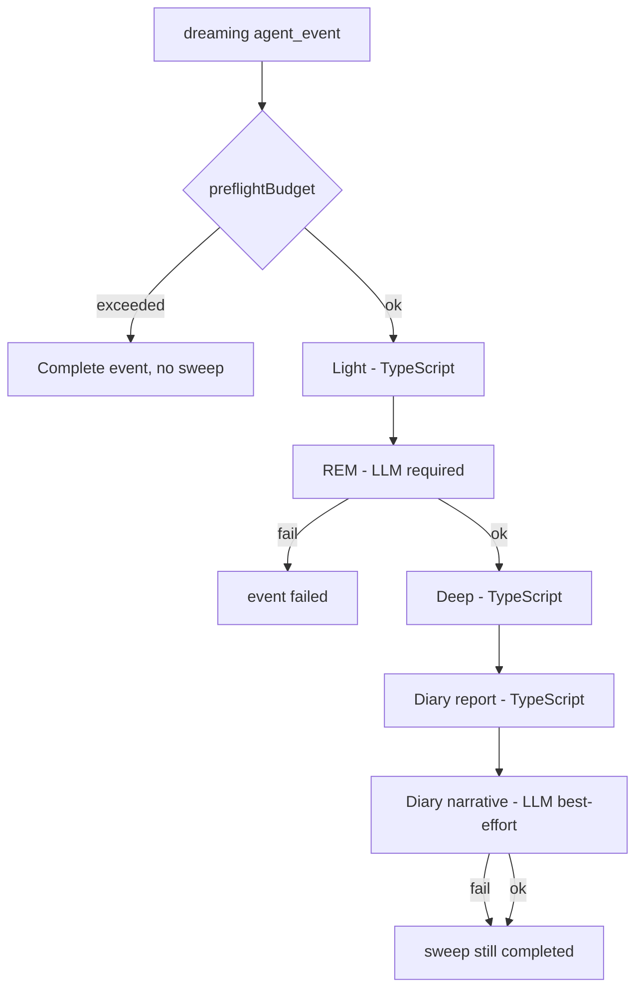

# Dreaming architecture (v2)

This document describes the target architecture for agent **dreaming**: offline
memory consolidation inspired by OpenClaw's `memory-core` pipeline, adapted to
Outname's Vercel Workflow + persistent sandbox model.

For system context see [ARCHITECTURE.md](./ARCHITECTURE.md).

## Product intent

Dreaming is **not** a free-form agent work session. It is a **memory
governance** job that:

1. Ingests recent evidence from the agent sandbox (and optionally durable event
   summaries).
2. Stages and deduplicates candidates (**Light**).
3. Interprets patterns and assigns semantic metadata (**REM**, always LLM).
4. Promotes only verified, high-scoring facts into durable memory (**Deep**,
   deterministic).
5. Appends a human-readable diary (**Diary**): structured report (TypeScript) plus
   an OpenClaw-style **best-effort narrative** sub-pass (LLM).

The sleep metaphor maps to **phases**, not to creative generation. Nothing in
`MEMORY.md` is authoritative because a model "felt it was true" during dreaming.

## OpenClaw parity (target)

This design aims to match OpenClaw `memory-core` behavior, adapted to Outname
infrastructure.

| OpenClaw concept | Outname v2 |
| --- | --- |
| Opt-in dreaming | `dreamingEnabled` |
| Scheduled sweep (e.g. cron `0 3 * * *`) | Daily sweep + optional `dreamingScheduleCron` / local hour |
| Isolated maintenance (no user delivery) | `handleDreaming` — activity stream only, no chat stream |
| `memory/.dreams/*` scratch | Same paths |
| Light → REM → Deep order | Same; REM LLM required when sweep runs |
| Only Deep writes `MEMORY.md` | `memory-core/promotion` only |
| `DREAMS.md` diary, not canonical | Diary report + narrative; never promotes |
| Dream Diary narrative subagent (best-effort) | `DiaryNarrative` LLM step after report |
| Ranking + rehydration + markers | Same in Deep phase |
| No self-ingestion of dream blocks | `guards/managed-blocks.ts` |
| Session + daily ingestion | Logs in v2; session corpus in PR7 |

## Core rules (non-negotiable)

| Rule | Meaning |
| --- | --- |
| **Budget gate** | If preflight budget fails, **nothing runs** — no sandbox writes in `.dreams/`, no `MEMORY.md` append, no LLM calls. |
| **REM always** | When the sweep runs, **REM is mandatory** between Light and Deep. No deterministic-only REM fallback, no "Light + Deep" shortcut. |
| **REM failure = sweep failure** | If REM errors or returns invalid structured output, the event fails; Deep does not promote. |
| **Deep is deterministic** | Ranking, rehydration, fences, and `MEMORY.md` append are TypeScript only. |
| **`MEMORY.md` promotion** | Only the Deep phase (via `memory-core`) may append consolidated lines during a dreaming sweep. |
| **`DREAMS.md` is not canonical** | Diary (report + narrative) is for observability; it never authorizes promotion. |
| **REM LLM required** | One structured REM call when the sweep runs (semantic layer). |
| **Diary narrative best-effort** | Second LLM call for readable prose (OpenClaw Dream Diary); failure does not fail the sweep. |



## Current state vs target

| Aspect | Today (v1) | Target (v2) |
| --- | --- | --- |
| Handler | `handleHeartbeat({ mode: 'dreaming' })` | `handleDreaming()` |
| Work | Full `ToolLoopAgent` stream with file tools | `memory-core` pipeline steps |
| Memory writes | LLM may edit `DREAMS.md`, `GOALS.md`, `TASKS.md`, logs | Only `memory-core` writes `.dreams/` and promotes `MEMORY.md`; diary updates `DREAMS.md` |
| Semantics | Entire pass is LLM judgment | REM only; Deep verifies against live files |
| Budget | Preflight skip; marks day done | Preflight skip; **no sweep side effects** (see scheduling note below) |

## Runtime placement

Dreaming remains a durable **`agent_events`** row of type `dreaming`, started by
`agentEventWorkflow` — same orchestration as heartbeat and invocation.

```
app/api/cron/liveness/route.ts
  → runAgentEventScheduler()
  → enqueueAgentEvent({ type: 'dreaming' })

agent-runtime/workflows/events/workflow.ts
  → handleDreaming()    # replaces handleHeartbeat for dreaming

agent-runtime/memory-core/
  → sweep orchestrator + phases + promotion
```

Realtime chat is unchanged: it does not run dreaming and does not use
`memory-core`.

## Sandbox layout

All paths are under the persistent system sandbox root (`/vercel/sandbox`).

| Path | Role | Written by |
| --- | --- | --- |
| `memory/.dreams/short-term-recall.json` | Candidate store (snippet, source, counters, tags, scores) | Light (upsert), REM (metadata) |
| `memory/.dreams/phase-signals.json` | Decaying boosts from Light/REM for Deep ranking | Light, REM |
| `memory/.dreams/daily-ingestion.json` | Checkpoint for processed `logs/*.md` | Light |
| `memory/.dreams/session-ingestion.json` | Checkpoint for exported session/event corpus | Light (phase 2) |
| `memory/.dreams/session-corpus/` | Compact text exports for non-log evidence | Light (phase 2) |
| `memory/.dreams/sweep-manifest.json` | Last sweep status, phase stats, errors | Sweep |
| `DREAMS.md` | Dated diary / report (non-canonical) | Diary |
| `MEMORY.md` | Durable consolidated memory | Deep only (append + markers) |
| `logs/YYYY-MM-DD.md` | Daily evidence (read by Light; not rewritten by sweep) | Agent during normal events |

### Path guards

Extend `sandbox-file-helpers/paths.ts`:

- Agent `writeFile` **must reject** `memory/.dreams/**` (scratch is runtime-only).
- During an active dreaming sweep, agent tools must not append `MEMORY.md` (Deep
  uses direct sandbox IO).

Tracked architecture listing should include `memory/.dreams/sweep-manifest.json`
and `DREAMS.md` for the UI; scratch JSON files can stay hidden or under a
`.dreams` UI filter.

## Phase specifications

### Light (TypeScript)

**Purpose:** Staging and deduplication — "tidy the desk."

**Inputs:**

- `logs/*.md` within `dreamingLookbackDays` (default 7), respecting
  `daily-ingestion.json`.
- Managed dreaming blocks stripped before ingest (prevent self-ingestion).

**Actions:**

1. List and read new/changed log files (respect `MAX_READ_FILE_BYTES`).
2. Extract line-level snippets (bullets, notable lines).
3. Normalize text; compute stable `candidateId`.
4. Upsert `short-term-recall.json` (increment `recallCount`, merge
   `queryContexts`, update timestamps).
5. Emit weak Light phase signals for repeat appearances.
6. Update `daily-ingestion.json`.

**Does not:** call LLM; write `MEMORY.md` or narrative `DREAMS.md`.

### REM (LLM, required)

**Purpose:** Semantic interpretation — themes, relevance, candidate reinforcement.

**Inputs:**

- `short-term-recall.json` (active candidates).
- `phase-signals.json`.
- Optional compact summaries of top snippets (token-capped).

**Actions:**

1. Single structured LLM call (or fixed small sequence) with **JSON schema**
   output, low temperature.
2. For each candidate (or batch): set/update `conceptTags`, `relevance` (0–1),
   optional `reflection` text, `lastingTruthCandidate` flag.
3. Append REM entries to `phase-signals.json` with decay metadata.
4. Persist updated recall store.

**Does not:** write `MEMORY.md`; append diary prose (that is Diary).

**On failure:** throw → workflow event `failed` → no Deep, no promotions.

REM is the **only** phase that interprets natural-language meaning. Downstream
code treats REM output as **untrusted hints** until Deep rehydrates sources.

### Deep (TypeScript)

**Purpose:** Authorize durable promotion.

**Inputs:**

- Recall store + active phase signals.
- Agent config: `dreamingPromotionThreshold`, `dreamingMaxPromotionsPerSweep`.

**Ranking** (weights aligned with OpenClaw defaults, configurable later):

| Signal | Default weight |
| --- | --- |
| frequency | 0.24 |
| relevance | 0.30 |
| queryDiversity | 0.15 |
| recency | 0.15 |
| consolidation | 0.10 |
| conceptualRichness | 0.06 |
| phaseBoost | capped (decayed signals from Light/REM) |

**Filters before promotion:**

- Already promoted (marker present).
- Score below threshold.
- Source missing or rehydration mismatch.
- Snippet inside managed dreaming fence.
- Insufficient context diversity (anti-noise).

**Promotion steps:**

1. `rehydrate(sourceRef)` — read live file, extract line range, compare to
   stored snippet.
2. Append to `MEMORY.md` with HTML marker:
   `<!-- dream-promoted:id=… source=… at=… -->`
3. Mark candidate `promoted: true` in recall store.

**Does not:** call LLM.

### Diary (report + narrative, OpenClaw-aligned)

Diary runs **only after** REM and Deep succeed. It has two sub-steps with
different contracts.

#### Diary report (TypeScript, always)

**Purpose:** Structured audit trail in `DREAMS.md` (same role as OpenClaw phase
reports / inline Light·REM·Deep summaries).

**Actions:**

1. Append a dated section from `sweep-manifest.json`, recall store, REM JSON,
   and promotion results.
2. Include phase stats, top themes (aggregated REM tags), REM reflection bullets,
   promoted lines with `sourceRef`, rejection counts.

**Does not:** call LLM; write `MEMORY.md`; run if REM/Deep did not complete.

**Template sketch:**

```markdown
## Dream 2026-05-22 (completed)

### Summary
- Ingested 12 log lines → 8 candidates
- REM updated 8 · Deep promoted 2

### Themes (REM)
- digest, brevity, slack

### Reflections (REM)
- …from REM JSON…

### Promoted to MEMORY.md
- [abc123] logs/2026-05-20.md:8 — …snippet…

### Skipped promotion
- 3 below threshold · 1 rehydration failed
```

#### Diary narrative (LLM, best-effort — OpenClaw Dream Diary)

**Purpose:** Short readable narrative for the Memory · Dreaming UI and human
review, matching OpenClaw’s “subagent best-effort” diary entry.

**When it runs:**

- After the report section is written.
- Only if `dreamingDiaryNarrativeEnabled` is true (default **on** for OpenClaw
  parity).
- Only if there is enough sweep material (e.g. ≥1 REM-updated candidate or ≥1
  promotion — same “enough material” idea as OpenClaw).

**Inputs (read-only, no new evidence):**

- `sweep-manifest.json`
- REM reflections / themes (structured)
- Promotion list from Deep (grounded lines only)
- **Not** raw logs (narrative must not introduce facts absent from report/REM/Deep)

**Actions:**

1. One bounded LLM call (low temperature, token cap).
2. Append under a `### Dream diary` (or `### Narrative`) heading in `DREAMS.md`.
3. Record usage as `sourceType: 'dreaming'`, sub-source `diary_narrative`.

**On failure (timeout, parse, budget after REM, provider error):**

- Log in `sweep-manifest.phases.diary.narrative: skipped | failed`.
- Emit activity: `Dream diary narrative skipped`.
- **Sweep status remains `completed`** — unlike REM.

**Does not:** promote to `MEMORY.md`; override REM/Deep decisions; re-ingest as
evidence in future Light passes (narrative blocks are managed / stripped).

**Why a second LLM if REM already reflects?**

OpenClaw separates **consolidation** (REM → Deep) from **explainability**
(narrative diary). REM output is machine-oriented JSON; the diary narrative is
human-oriented prose — same split we adopt for parity.

## Data models (sketch)

```typescript
interface RecallCandidate {
  id: string
  sourceRef: string // "logs/2026-05-21.md:14" | "session:evt_…"
  snippet: string
  conceptTags: string[]
  recallCount: number
  firstSeenAt: string
  lastSeenAt: string
  queryContexts: string[]
  relevance: number // 0..1, set by REM
  lastingTruthCandidate: boolean
  promoted: boolean
  promotionMarker?: string
}

interface PhaseSignal {
  candidateId: string
  phase: 'light' | 'rem'
  boost: number
  decayAfter: string
  reason: string
}

interface SweepManifest {
  localDate: string
  startedAt: string
  completedAt?: string
  status: 'running' | 'completed' | 'failed'
  phases: {
    light: { ingested: number; candidates: number }
    rem: { model: string; updated: number }
    deep: { promoted: number; rejected: number }
    diary: {
      reportWritten: boolean
      narrative: 'written' | 'skipped' | 'failed' | 'not_applicable'
      narrativeError?: string
    }
  }
  error?: string
}
```

## Budget integration

### Start gate (nothing runs)

Dreaming uses **`preflightBudget`** before any sweep work — same as heartbeat
today.

```typescript
// handleDreaming (pseudocode)
const userId = await checkBudgetOrFinalize({ agentId, mode: 'dreaming', runId })
if (userId === BUDGET_EXCEEDED) {
  await markDreamingSkippedNoSweep({ agentId, localDate })
  return
}
await runDreamingSweepStep({ agentId, localDate, userId })
```

**Invariant:** if preflight fails, **no** Light, REM, Deep, or Diary — zero
sandbox side effects.

Preflight must ensure there is headroom for at least the **REM** estimate
(configured token caps × model cost). That is the minimum bar to start.

### During sweep (REM vs narrative)

| Call | Budget contract |
| --- | --- |
| **REM** | Required. Failure → sweep **failed**. |
| **Diary narrative** | Best-effort. Before calling, optional `preflightBudget` (or spend check) with a small **narrative reserve** estimate. If over limit after REM spend → skip narrative, sweep **completed**. |

This preserves your rule (**no budget → nothing**) while matching OpenClaw (**narrative diary is best-effort**, not a promotion gate).

Token usage: both REM and diary narrative use `sourceType: 'dreaming'` (narrative
tagged in metadata for analytics).

### Scheduling when budget-blocked

When the sweep does not run due to budget:

- Do **not** update `lastDreamingLocalDate` (scheduler may enqueue again on a
  later cron tick the same local day once budget is available).
- Contrast with v1, which marked the day complete on budget skip — v2 intentionally
  retries.

When the sweep **fails** (REM/Deep error):

- Do not update `lastDreamingLocalDate` (retry eligible).
- Persist failure on `agent_events.last_error` and `sweep-manifest.json` if
  partially written (manifest should use running → failed atomically per phase
  where possible).

When the sweep **completes**:

- Update `lastDreamingAt`, `lastDreamingLocalDate` as today.

## Scheduler

Keep **once per owner local calendar day** unless `dreamingScheduleHour` is set
(future migration): due when `lastDreamingLocalDate !== today` and (optional)
local hour ≥ configured hour.

Cron ingress unchanged: `/api/cron/liveness` every five minutes.

Manual **Dream now** enqueues the same pipeline with `manual: true` and a fresh
idempotency key (no concurrency queue).

## Workflow steps

Each heavy phase is a Vercel Workflow **`'use step'`** shim (sandbox and DB are
unavailable inside pure workflow functions):

| Step | Calls |
| --- | --- |
| `runDreamingSweepStep` | `memory-core/sweep.ts` |
| `runLightPhaseStep` | `phases/light.ts` |
| `runRemPhaseStep` | `phases/rem.ts` + AI Gateway |
| `runDeepPhaseStep` | `phases/deep.ts` |
| `runDiaryReportStep` | `phases/diary-report.ts` |
| `runDiaryNarrativeStep` | `phases/diary-narrative.ts` (LLM, best-effort) |

Activity stream (`emitActivity`) reports phase boundaries for the event UI; no
full model stream to the user for scheduled dreaming.

## Session evidence (phase 2)

v1 ingestion is **`logs/*.md` only**. OpenClaw also ingests session transcripts.

Phase 2 adds `ingestion/session-events.ts`:

- Export completed `agent_events` since last checkpoint into
  `session-corpus/{eventId}.txt`.
- Light treats `sourceRef: session:…` like log lines.

Realtime `chat_message` history is out of scope for v1/v2 unless explicitly
added later (PII/retention policy required).

## Agent configuration

| Field | Purpose |
| --- | --- |
| `dreamingEnabled` | Existing toggle |
| `dreamingLookbackDays` | Light window (default 7) |
| `dreamingPromotionThreshold` | Deep cutoff (default 0.62) |
| `dreamingMaxPromotionsPerSweep` | Cap promotions (default 5) |
| `dreamingDiaryNarrativeEnabled` | Default `true` (OpenClaw parity); set `false` to skip narrative LLM |
| `dreamingScheduleCron` | Optional cron expression (OpenClaw-style, e.g. `0 3 * * *`); else once per local day on first scheduler tick |
| `dreamingRemMaxOutputTokens` / `dreamingNarrativeMaxOutputTokens` | Caps for cost estimates and call limits |

Models: default to agent model; optional `dreamingRemModel` / `dreamingNarrativeModel`
(cheaper model for narrative is allowed).

## AGENTS.md and prompts

Update `agents-md-template.ts` **Dreaming behavior** section:

- Dreaming is automatic; agents do not run a manual "dreaming pass" during chat.
- Do not write `memory/.dreams/**`.
- Do not promote into `MEMORY.md` during dreaming events; consolidation is
  runtime-owned.
- `DREAMS.md` is written by the system diary step (report + optional narrative).
- Narrative diary text is not evidence and must not be cited for promotion.

Remove `buildDreamingKickoff` multi-step LLM instructions from the dreaming
path. `compose-system-prompt.ts` `eventKind: 'dreaming'` may shrink to a short
note for any edge case that still routes through agent tools (should not happen
for scheduled events).

## Security and contamination

| Safeguard | Implementation |
| --- | --- |
| No self-ingestion | Strip `<!-- dream:* -->` and managed report blocks before Light ingest |
| Rehydration | Deep reads live source; promotion text must match |
| Fence check | Reject snippets inside dreaming-managed fences |
| Promotion markers | Prevent duplicate `MEMORY.md` appends |
| Scratch isolation | `.dreams/` not agent-writable |
| Budget gate | No work, no writes when preflight fails |

## Testing strategy

| Layer | Focus |
| --- | --- |
| Unit | ranking, rehydrate, managed-block strip, dedup ids |
| Integration | fixture sandbox dir → sweep → expected `MEMORY.md` markers |
| Workflow | `dreaming` event dispatches `handleDreaming`, budget skip invokes zero steps |

## Rollout

1. Feature flag `dreamingPipelineV2` per agent or environment.
2. Shadow mode (optional): run sweep, write manifest + `.dreams/`, **do not**
   append `MEMORY.md` until validated.
3. Enable promotion; disable v1 LLM dreaming path.
4. Remove `handleHeartbeat` dreaming branch and `buildDreamingKickoff`.

## Implementation sequence

| PR | Scope |
| --- | --- |
| 1 | `memory-core` types, IO, guards, ranking, rehydrate, promote |
| 2 | Light + log ingestion + tests |
| 3 | REM structured LLM + phase signals + tests |
| 4 | Deep + `MEMORY.md` append |
| 5 | `handleDreaming`, workflow wiring, budget/scheduler semantics, remove v1 LLM sweep |
| 6 | Diary report + diary narrative (best-effort) + `DREAMS.md` + UI copy + AGENTS template |
| 7 | Session ingestion + optional schedule hour |

## Mental model (FAQ)

**Why call it "deterministic" if REM uses an LLM?**

The **promotion law** is deterministic: fixed ranking, thresholds, source
verification, and single writer to `MEMORY.md`. REM supplies **structured hints**
(relevance, tags); it does not directly decide durable memory.

**What if budget is zero?**

Nothing starts. The agent does not "partially dream."

**What if budget exists?**

Light → REM → Deep always runs REM. No shortcuts.

**How many LLM calls?**

Up to two per sweep: **REM** (required) and **diary narrative** (best-effort).
Light and Deep are TypeScript. The narrative does not replace REM; it explains
the sweep for humans without touching `MEMORY.md`.

**What if narrative is skipped?**

The structured report is always present when the sweep completes; UI still shows
themes, promotions, and REM reflections. OpenClaw treats narrative as best-effort
for the same reason.
