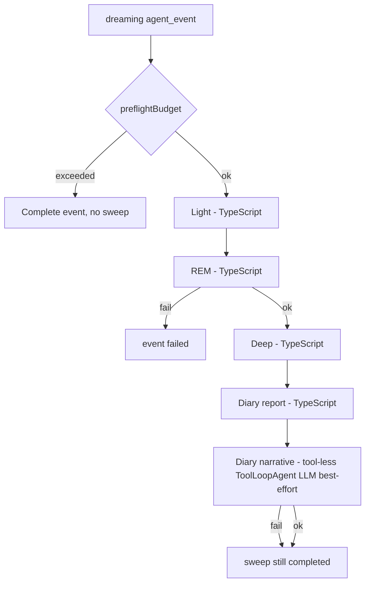

# Dreaming architecture (v2)

This document describes the target architecture for agent **dreaming**: offline
memory consolidation inspired by OpenClaw's `memory-core` pipeline, adapted to
Outname's Vercel Workflow + persistent sandbox model.

For system context see [ARCHITECTURE.md](./ARCHITECTURE.md). For the decision
record see
[ADR 0005](./adr/0005-dreaming-v2-memory-governance.md).

## Product intent

Dreaming is **not** a free-form agent work session. It is a **memory
governance** job that:

1. Ingests recent evidence from the agent sandbox (and optionally durable event
   summaries).
2. Stages and deduplicates candidates (**Light**).
3. Reinforces recurring patterns and assigns semantic metadata (**REM**,
   deterministic).
4. Promotes only verified, high-scoring facts into durable memory (**Deep**,
   deterministic).
5. Appends a human-readable diary (**Diary**): structured report (TypeScript) plus
   a **best-effort narrative** sub-pass (LLM).

The sleep metaphor maps to **phases**, not to creative generation. Nothing in
`MEMORY.md` is authoritative because a model "felt it was true" during dreaming.

## OpenClaw-Inspired Design

This design uses OpenClaw `memory-core` as architectural inspiration, then
defines Outname-owned runtime contracts, storage, markers, and UI behavior. It
does not aim for wire compatibility with OpenClaw artifacts or marker formats.
The phase names **Light**, **REM**, and **Deep** are retained as generic sleep
metaphors, but their behavior is defined by this Outname document.

| Inspiration | Outname v2 decision |
| --- | --- |
| Opt-in dreaming | `dreamingEnabled` |
| Scheduled sweep (e.g. cron `0 3 * * *`) | Daily sweep + optional `dreamingScheduleCron` / local hour |
| Isolated maintenance (no user delivery) | `handleDreaming` — activity stream only, no chat stream |
| `memory/.dreams/*` scratch | Outname namespace with primary state in sandbox-backed SQLite |
| Light → REM → Deep order | Adopted phase order; REM is the required deterministic middle phase |
| Only Deep writes `MEMORY.md` | Outname `memory-core/promotion` only |
| `DREAMS.md` diary, not canonical | Diary report + narrative; never promotes |
| Dream Diary narrative subagent (best-effort) | Tool-less `DiaryNarrative` ToolLoopAgent LLM step after report |
| Ranking + rehydration + markers | Similar safety behavior; Outname-owned marker format |
| No self-ingestion of dream blocks | `guards/managed-blocks.ts` |
| Event transcript + daily ingestion | Adopted evidence mix; event transcripts are read transiently, not persisted in sandbox |

## Core rules (non-negotiable)

| Rule | Meaning |
| --- | --- |
| **Budget gate** | If preflight budget fails, **nothing runs** — no `DreamingStore` writes, no sandbox writes, no `MEMORY.md` append, no `DREAMS.md` update, no LLM calls. |
| **Outname phase names** | Light, REM, and Deep remain the canonical phase names; they do not imply upstream compatibility. |
| **REM always** | When the sweep runs, **REM is mandatory** between Light and Deep. No "Light + Deep" shortcut. |
| **REM failure = sweep failure** | If REM errors or produces inconsistent phase state, the event fails; Deep does not promote. |
| **Required phase failure = event failure** | If Light, REM, or Deep fails, the `dreaming` event is `failed`; the local day is not marked complete. |
| **Deep is deterministic** | Ranking, rehydration, fences, and `MEMORY.md` append are TypeScript only. |
| **`MEMORY.md` promotion** | Only the Deep phase (via `memory-core`) may append consolidated lines during a dreaming sweep. |
| **Outname promotion marker** | Durable promotions use an Outname-specific HTML marker, not an upstream-compatible marker string. |
| **`DREAMS.md` is not canonical** | Diary (report + narrative) is for observability; it never authorizes promotion. |
| **REM is deterministic** | REM derives machine-oriented hints from staged evidence; it is not an LLM call. |
| **Diary narrative best-effort** | The only dreaming LLM call is readable diary prose; failure does not fail the sweep. |
| **Diary has no tools** | The narrative ToolLoopAgent receives prepared inputs and no sandbox/file tools; TypeScript appends accepted output to `DREAMS.md`. |
| **Single diary file** | `DREAMS.md` is the only default human-readable diary file; per-day/per-phase reports are debug/export only. |
| **One sweep per agent** | Scheduled and manual dreaming share the same per-agent concurrency key; no two sweeps may write the same `DreamingStore`, `DREAMS.md`, or `MEMORY.md` concurrently. |



## Current state vs target

| Aspect | Today (v1) | Target (v2) |
| --- | --- | --- |
| Handler | `handleHeartbeat({ mode: 'dreaming' })` | `handleDreaming()` |
| Work | Full `ToolLoopAgent` stream with file tools | `memory-core` pipeline steps |
| Memory writes | LLM may edit `DREAMS.md`, `GOALS.md`, `TASKS.md`, logs | Only `memory-core` writes `.dreams/` and promotes `MEMORY.md`; diary updates `DREAMS.md` |
| Semantics | Entire pass is LLM judgment | Light, REM, and Deep are deterministic; Diary narrative is the only LLM pass |
| Budget | Preflight skip; marks day done | Preflight skip; **no sweep side effects** (see scheduling note below) |

## Runtime placement

Dreaming remains a durable **`agent_events`** row of type `dreaming`, started by
`agentEventWorkflow` — same orchestration as heartbeat and invocation.

```
app/api/cron/liveness/route.ts
  → runAgentEventScheduler()
  → enqueueAgentEvent({ type: 'dreaming' })

agent-runtime/workflows/events/workflow.ts
  → handleDreaming()    # replaces handleHeartbeat for dreaming

agent-runtime/memory-core/
  → sweep orchestrator + phases + promotion
```

Realtime chat is unchanged: it does not run dreaming and does not use
`memory-core`.

## Sandbox layout

All paths are under the persistent system sandbox root (`/vercel/sandbox`).

| Path | Role | Written by |
| --- | --- | --- |
| `memory/.dreams/dreaming.sqlite` | Primary `DreamingStore`: recall candidates, phase signals, ingestion checkpoints, sweep manifests, locks | Sweep phases |
| `DREAMS.md` | Cumulative dated diary / report (non-canonical) | Diary |
| `MEMORY.md` | Durable consolidated memory | Deep only (append + markers) |
| `logs/YYYY-MM-DD.md` | Daily evidence (read by Light; not rewritten by sweep) | Agent during normal events |

### Path guards

Extend `sandbox-file-helpers/paths.ts`:

- Agent `writeFile` **must reject** `memory/.dreams/**` (scratch is runtime-only).
- During an active dreaming sweep, agent tools must not append `MEMORY.md` (Deep
  uses direct sandbox IO).

Tracked architecture listing should include `DREAMS.md`. The SQLite store is
runtime scratch and should stay hidden behind a `.dreams` UI filter.

`memory/.dreams/sweep-manifest.json` is not written by default. It may exist only
behind an explicit debug/export option; runtime behavior and normal UI must read
sweep state from `DreamingStore` or from the human-readable `DREAMS.md` report.

Per-day or per-phase diary files are also not written by default. If needed for
diagnostics, they follow the same explicit debug/export rule as the manifest and
must not become evidence for future Light ingestion.

## Phase specifications

### Light (TypeScript)

**Purpose:** Staging and deduplication — "tidy the desk."

**Inputs:**

- `logs/*.md` within `dreamingLookbackDays` (default 7), respecting the
  `DreamingStore` daily ingestion checkpoint.
- Completed `agent_events` transcripts since the event-transcript ingestion
  checkpoint, read from the persisted transcript store and processed in memory.
- Managed dreaming blocks stripped before ingest (prevent self-ingestion).

**Actions:**

1. List and read new/changed log files (respect `MAX_READ_FILE_BYTES`) and
   completed event transcripts (respect per-event and per-sweep caps).
2. Extract line-level snippets from logs and compact transcript activity from
   event transcripts.
3. Normalize text; compute stable `candidateId`.
4. Upsert recall candidates through `DreamingStore` (increment `recallCount`,
   merge `queryContexts`, update timestamps).
5. Emit weak Light phase signals for repeat appearances.
6. Update daily-log and event-transcript ingestion checkpoints.

**Does not:** call LLM; write `MEMORY.md`; write narrative `DREAMS.md`; persist
raw or compact transcript files in the sandbox.

### REM (TypeScript, required)

**Purpose:** Pattern reinforcement — themes, tags, and candidate signals derived
from staged evidence.

**Inputs:**

- Active candidates from `DreamingStore`.
- Existing phase signals from `DreamingStore`.
- Staged Light keys and source snippets.

**Actions:**

1. Prefer Light-staged keys from the current sweep.
2. Derive/merge `conceptTags`, candidate reinforcement, and optional reflection
   text from candidate evidence using deterministic rules.
3. Record REM phase signals with decay metadata.
4. Persist updated recall store.

**Does not:** write `MEMORY.md`; append diary prose (that is Diary).

**On failure:** throw → workflow event `failed` → no Deep, no promotions.

REM output is **untrusted hints** until Deep rehydrates sources. It reinforces
what should be considered; it does not authorize durable memory.

### Deep (TypeScript)

**Purpose:** Authorize durable promotion.

**Inputs:**

- Recall store + active phase signals.
- Agent config: conservative Deep defaults.

**Ranking** (conservative defaults, configurable later):

| Signal | Default weight |
| --- | --- |
| frequency | 0.24 |
| relevance | 0.30 |
| queryDiversity | 0.15 |
| recency | 0.15 |
| consolidation | 0.10 |
| conceptualRichness | 0.06 |
| phaseBoost | capped (decayed signals from Light/REM) |

**Default promotion policy** (conservative):

| Setting | Default |
| --- | --- |
| `dreamingPromotionMinScore` | `0.8` |
| `dreamingPromotionMinRecallCount` | `3` |
| `dreamingPromotionMinUniqueQueries` | `3` |
| `dreamingMaxPromotionsPerSweep` | `10` |
| `dreamingPromotionMaxAgeDays` | `30` |
| `dreamingPromotionRecencyHalfLifeDays` | `14` |
| `dreamingMaxPromotedSnippetTokens` | `160` |

**Filters before promotion:**

- Already promoted (marker present).
- Score below threshold.
- Recall count below minimum.
- Unique query/context diversity below minimum.
- Candidate older than the promotion age window.
- Source missing or rehydration mismatch.
- Snippet inside managed dreaming fence.
- Insufficient context diversity (anti-noise).

**Promotion steps:**

1. `rehydrate(sourceRef)` — read live file, extract line range, compare to
   stored snippet.
2. Append to `MEMORY.md` with an Outname-owned HTML marker:
   `<!-- outname:dreaming:promotion key="…" source="…" at="…" -->`
3. Mark candidate `promoted: true` in recall store.

Promotion markers are intentionally application-specific. The implementation
should not copy or emulate upstream marker strings; the marker is part of
Outname's memory file contract.

**Does not:** call LLM.

### Diary (report + narrative)

Diary runs **only after** REM and Deep succeed. It has two sub-steps with
different contracts.

#### Diary report (TypeScript, always)

**Purpose:** Structured audit trail in `DREAMS.md`, serving the Outname version
of a phase summary for Light, REM, and Deep.

**Actions:**

1. Append a dated section from `DreamingStore` sweep state, recall store, REM metadata,
   and promotion results.
2. Include phase stats, top themes (aggregated REM tags), REM reflection bullets,
   promoted lines with `sourceRef`, rejection counts.
3. Keep the report in the cumulative `DREAMS.md`; do not create per-day or
   per-phase report files during normal sweeps.

**Does not:** call LLM; write `MEMORY.md`; run if REM/Deep did not complete.

**Template sketch:**

```markdown
## Dream 2026-05-22 (completed)

### Summary
- Ingested 12 log lines → 8 candidates
- REM updated 8 · Deep promoted 2

### Themes (REM)
- digest, brevity, slack

### Reflections (REM)
- From REM metadata.

### Promoted to MEMORY.md
- [abc123] logs/2026-05-20.md:8 — …snippet…

### Skipped promotion
- 3 below threshold · 1 rehydration failed
```

#### Diary narrative (LLM, best-effort)

**Purpose:** Short readable narrative for the Memory · Dreaming UI and human
review. It follows the same product split as the rest of the design:
consolidation is deterministic, explanation is best-effort prose.

The narrative uses `ToolLoopAgent` to preserve the agent abstraction, but it is a
**tool-less** agent: no `buildRuntimeToolset()`, no sandbox file tools, no
network/tool providers, and no direct writes.

**When it runs:**

- After the report section is written.
- Only if `dreamingDiaryNarrativeEnabled` is true (default **on** for the
  inspired design).
- Only if there is enough sweep material (e.g. ≥1 REM-updated candidate or ≥1
  promotion).

**Inputs (read-only, no new evidence):**

- A bounded runtime-prepared payload from `DreamingStore` sweep state.
- REM reflections / themes (structured).
- Promotion list from Deep (grounded lines only).
- **Not** raw logs (narrative must not introduce facts absent from report/REM/Deep)

**Actions:**

1. Instantiate `DiaryNarrative` as a `ToolLoopAgent` with no tools and a bounded
   prompt payload.
2. Produce a short narrative string or structured narrative object.
3. Validate and cap the returned narrative in TypeScript.
4. Append accepted output under a `### Dream diary` (or `### Narrative`) heading
   in `DREAMS.md` from the Diary runtime step, not from the model.
5. Record usage as `sourceType: 'dreaming'`, sub-source `diary_narrative`.

**On failure (timeout, parse, budget after REM, provider error):**

- Log in the sweep state: `phases.diary.narrative: skipped | failed`.
- Emit activity: `Dream diary narrative skipped`.
- **Sweep status remains `completed`** — unlike REM.

**Does not:** promote to `MEMORY.md`; override REM/Deep decisions; become
evidence for future Light passes; call tools; read files; write files. Narrative
blocks are managed / stripped.

**Why use an LLM only for narrative?**

The source design separates deterministic **consolidation** (Light → REM → Deep)
from best-effort **explainability** (narrative diary). Outname adopts that split
while keeping its own storage, marker, and UI contracts.

## Data models (sketch)

```typescript
interface DreamingStore {
  upsertRecallCandidate(candidate: RecallCandidate): Promise<void>
  listActiveRecallCandidates(input: RecallQuery): Promise<RecallCandidate[]>
  recordPhaseSignal(signal: PhaseSignal): Promise<void>
  updateIngestionCheckpoint(checkpoint: IngestionCheckpoint): Promise<void>
  beginSweep(input: BeginSweepInput): Promise<SweepManifest>
  updateSweepManifest(manifest: SweepManifest): Promise<void>
}

interface BeginSweepInput {
  localDate: string
  startedAt: string
  trigger: 'scheduled' | 'manual'
}

interface RecallQuery {
  lookbackDays: number
  limit?: number
  stagedKeys?: string[]
}

interface IngestionCheckpoint {
  source: 'daily-log' | 'event-transcript'
  cursor: string
  processedAt: string
}

interface RecallCandidate {
  id: string
  sourceRef: string // "logs/2026-05-21.md:14" | "event:evt_…"
  snippet: string
  conceptTags: string[]
  recallCount: number
  firstSeenAt: string
  lastSeenAt: string
  queryContexts: string[]
  relevance: number // 0..1, computed by REM
  lastingTruthCandidate: boolean
  promoted: boolean
  promotionMarker?: string
}

interface PhaseSignal {
  candidateId: string
  phase: 'light' | 'rem'
  boost: number
  decayAfter: string
  reason: string
}

interface SweepManifest {
  localDate: string
  startedAt: string
  completedAt?: string
  status: 'running' | 'completed' | 'failed'
  phases: {
    light: {
      ingested: number
      candidates: number
      transcriptEventsConsidered: number
      transcriptEventsTruncated: number
    }
    rem: { considered: number; updated: number }
    deep: { promoted: number; rejected: number }
    diary: {
      reportWritten: boolean
      narrative: 'written' | 'skipped' | 'failed' | 'not_applicable'
      narrativeError?: string
    }
  }
  error?: string
}
```

## Budget integration

### Start gate (nothing runs)

Dreaming uses **`preflightBudget`** before any sweep work — same as heartbeat
today.

```typescript
// handleDreaming (pseudocode)
const userId = await checkBudgetOrFinalize({ agentId, mode: 'dreaming', runId })
if (userId === BUDGET_EXCEEDED) {
  await completeDreamingBudgetSkipped({ agentId, localDate, runId })
  return
}
await runDreamingSweepStep({ agentId, localDate, userId })
```

**Invariant:** if preflight fails, **no** Light, REM, Deep, or Diary — zero
sandbox side effects.

Preflight checks whether the agent is budget-blocked before any sweep side
effects. Since Light, REM, and Deep do not call a model, starting the sweep does
not require reserving REM model spend. The gate is still total by design: budget
is an operational stop, not merely a model-spend check.

On budget block, `handleDreaming` must not create or mutate
`memory/.dreams/dreaming.sqlite`, ingestion checkpoints, `DREAMS.md`, or
`MEMORY.md`.

The `agent_events` row should still finish as `completed` with an explicit
outcome/metadata value such as `budget_skipped`. The workflow handled the event
successfully; it simply did not run a sweep.

### During sweep (deterministic vs narrative)

| Work | Budget contract |
| --- | --- |
| **Light / REM / Deep** | Required deterministic phases. Failure → sweep **failed**. |
| **Diary narrative** | Best-effort model call. Before calling, optional `preflightBudget` (or spend check) with a small **narrative reserve** estimate. If over limit after deterministic consolidation → skip narrative, sweep **completed**. |

This preserves your rule (**no budget → nothing**) while keeping the inspired
diary narrative best-effort rather than a promotion gate.

Token usage: diary narrative uses `sourceType: 'dreaming'` with narrative
metadata for analytics.

### Scheduling when budget-blocked

When the sweep does not run due to budget:

- Complete the event with outcome `budget_skipped`.
- Do **not** update `lastDreamingLocalDate` (scheduler may enqueue again on a
  later cron tick the same local day once budget is available).
- Contrast with v1, which marked the day complete on budget skip — v2 intentionally
  retries.

When the sweep **fails** (Light/REM/Deep error):

- Mark the `agent_events` row `failed`.
- Do not update `lastDreamingLocalDate` (retry eligible).
- Persist failure on `agent_events.last_error` and in `DreamingStore` if
  partially written (manifest state should use running → failed atomically per
  phase where possible).
- Do not run Diary report or Diary narrative after a required phase failure.

Retry semantics after failure:

- A retry starts a new sweep attempt with a new sweep manifest/attempt identity.
- Do **not** rollback the whole `DreamingStore`; recall candidates and phase
  signals remain as accumulated evidence.
- Upserts must be idempotent by candidate key, source reference, and
  query/context hash so repeated ingestion does not inflate counts incorrectly.
- Ingestion checkpoints advance only after the corresponding log/event evidence
  has been considered within caps. If a phase fails before a checkpoint is safe,
  the next attempt may re-read that evidence and rely on idempotent upserts.
- Deep remains protected by source rehydration and promotion markers in
  `MEMORY.md`, so a retry cannot duplicate an already promoted memory line.

When the sweep **completes**:

- Update `lastDreamingAt`, `lastDreamingLocalDate` as today.

## Scheduler

Keep **once per owner local calendar day** unless `dreamingScheduleHour` is set
(future migration): due when `lastDreamingLocalDate !== today` and (optional)
local hour ≥ configured hour.

Cron ingress unchanged: `/api/cron/liveness` every five minutes.

Manual **Dream now** enqueues the same pipeline with `manual: true` and a fresh
idempotency key, but it must use the same per-agent dreaming concurrency key as
scheduled dreaming.

Idempotency and concurrency are intentionally separate:

- Scheduled idempotency remains calendar-slot based, so cron retries are
  deduplicated.
- Manual idempotency remains per click/request, so a user can request a fresh
  run.
- Both sources share `dreaming:<agentId>` (or equivalent) as the concurrency key,
  so a manual run cannot overlap a scheduled run.
- If a sweep is already active, **Dream now** must not start a second sweep. It
  returns the existing active or queued dreaming event for that agent.
- Manual **Dream now** is therefore UX-idempotent while a sweep is active: repeated
  clicks point at the same event instead of creating additional queued work.

## Workflow steps

Each heavy phase is a Vercel Workflow **`'use step'`** shim (sandbox and DB are
unavailable inside pure workflow functions):

| Step | Calls |
| --- | --- |
| `runDreamingSweepStep` | `memory-core/sweep.ts` |
| `runLightPhaseStep` | `phases/light.ts` |
| `runRemPhaseStep` | `phases/rem.ts` deterministic metadata + phase signals |
| `runDeepPhaseStep` | `phases/deep.ts` |
| `runDiaryReportStep` | `phases/diary-report.ts` |
| `runDiaryNarrativeStep` | `phases/diary-narrative.ts` (tool-less ToolLoopAgent LLM, best-effort) |

Activity stream (`emitActivity`) reports phase boundaries for the event UI; no
full model stream to the user for scheduled dreaming.

## Event transcript evidence

Light ingests completed `agent_events` transcripts in the first release so the
memory pipeline sees both daily logs and actual work sessions.

The transcript ingestion contract is intentionally non-persistent in the
sandbox:

- Query completed events since the `event-transcript` checkpoint.
- Read persisted `agent_event_message` rows from the database-backed transcript
  store in `message_order`.
- Convert bounded transcript activity into candidate snippets in memory.
- Upsert only deduplicated recall candidates and checkpoint state into
  `DreamingStore`.
- Do **not** write `session-corpus/`, raw transcript files, or compact transcript
  exports under `/vercel/sandbox`.

Transcript ingestion is also intentionally bounded:

- Limit events per sweep, messages per event, text bytes per event, text bytes
  per sweep, and snippets per event.
- If a single event exceeds per-event caps, extract only the bounded activity,
  record a truncation counter in the sweep state, and mark that event processed.
  Otherwise a single huge event would be retried forever.
- If the sweep-level cap is reached before reading the next event, stop and
  advance the checkpoint only through the last event actually considered. Later
  events remain eligible on the next sweep.
- Prefer activity/status/error text and assistant/user text parts; ignore binary
  or non-text parts for memory candidacy.

Realtime `chat_message` history is out of scope for v1/v2 unless explicitly
added later (PII/retention policy required).

## Agent configuration

| Field | Purpose |
| --- | --- |
| `dreamingEnabled` | Existing toggle |
| `dreamingLookbackDays` | Light window (default 7) |
| `dreamingPromotionMinScore` | Deep cutoff (default `0.8`) |
| `dreamingPromotionMinRecallCount` | Minimum recall frequency for promotion (default `3`) |
| `dreamingPromotionMinUniqueQueries` | Minimum evidence diversity for promotion (default `3`) |
| `dreamingMaxPromotionsPerSweep` | Cap promotions (default `10`) |
| `dreamingPromotionMaxAgeDays` | Maximum candidate age for promotion (default `30`) |
| `dreamingPromotionRecencyHalfLifeDays` | Recency scoring half-life (default `14`) |
| `dreamingMaxPromotedSnippetTokens` | Maximum promoted snippet size (default `160`) |
| `dreamingMaxTranscriptEventsPerSweep` | Cap completed events scanned by Light |
| `dreamingMaxTranscriptMessagesPerEvent` | Cap transcript rows read per event |
| `dreamingMaxTranscriptBytesPerEvent` | Cap extracted transcript text per event |
| `dreamingMaxTranscriptBytesPerSweep` | Aggregate transcript text cap per sweep |
| `dreamingMaxTranscriptSnippetsPerEvent` | Cap candidate snippets produced by one event |
| `dreamingDiaryNarrativeEnabled` | Default `true` for the inspired design; set `false` to skip narrative LLM |
| `dreamingScheduleCron` | Optional cron expression (e.g. `0 3 * * *`); else once per local day on first scheduler tick |
| `dreamingNarrativeMaxOutputTokens` | Cap for narrative cost estimates and call limits |

Models: the narrative defaults to the agent model; optional
`dreamingNarrativeModel` can choose a cheaper model for diary prose.

## AGENTS.md and prompts

Update `agents-md-template.ts` **Dreaming behavior** section:

- Dreaming is automatic; agents do not run a manual "dreaming pass" during chat.
- Do not write `memory/.dreams/**`.
- Do not promote into `MEMORY.md` during dreaming events; consolidation is
  runtime-owned.
- `DREAMS.md` is written by the system diary step (report + optional narrative).
- Narrative diary text is not evidence and must not be cited for promotion.
- Diary narrative uses a tool-less `ToolLoopAgent`; agents do not receive file
  tools or edit `DREAMS.md` directly.

Remove `buildDreamingKickoff` multi-step LLM instructions from the dreaming
path. `compose-system-prompt.ts` `eventKind: 'dreaming'` may shrink to a short
note for any edge case that still routes through agent tools (should not happen
for scheduled events).

## Security and contamination

| Safeguard | Implementation |
| --- | --- |
| No self-ingestion | Strip `<!-- dream:* -->` and managed report blocks before Light ingest |
| Rehydration | Deep reads live source; promotion text must match |
| Fence check | Reject snippets inside dreaming-managed fences |
| Promotion markers | Use Outname-owned markers to prevent duplicate `MEMORY.md` appends |
| Scratch isolation | `.dreams/` not agent-writable |
| Budget gate | No work, no writes when preflight fails; event completes with `budget_skipped` |
| Required phase failure | Light/REM/Deep failure marks the event `failed` and keeps the day retryable |
| Retry idempotence | Failed sweeps retry as new attempts over the same idempotent `DreamingStore`; no global rollback |
| Run serialization | Scheduled and manual sweeps share one per-agent concurrency key |
| Manual trigger idempotence | **Dream now** returns an existing active/queued sweep instead of enqueueing another |
| Tool-less diary | Diary narrative has no sandbox/file tools; runtime owns `DREAMS.md` writes |
| Single diary file | Normal sweeps write only cumulative `DREAMS.md`; separate report files are debug/export only |

## Testing strategy

| Layer | Focus |
| --- | --- |
| Unit | ranking, rehydrate, managed-block strip, dedup ids, transcript cap/truncation policy, diary narrative output validation, retry idempotence |
| Integration | fixture sandbox dir + transcript fixtures → sweep → expected Outname-owned `MEMORY.md` markers, cumulative `DREAMS.md`, and no transcript or separate report files in sandbox |
| Workflow | `dreaming` event dispatches `handleDreaming`, budget skip completes with `budget_skipped` and invokes zero steps, required phase failure marks the event `failed` without updating `lastDreamingLocalDate`, retry starts a new attempt over idempotent store state, manual/scheduled sweeps serialize on the same concurrency key, repeated **Dream now** returns the active/queued event, diary narrative receives no file tools |

## Cutover

No feature flags or shadow mode. When `memory-core` ships, it **replaces** v1 in
one release:

- `workflow.ts` dispatches `handleDreaming` only (remove `handleHeartbeat` dreaming branch).
- Delete `buildDreamingKickoff` and LLM-based dreaming instructions from the agent path.
- Scheduled and manual **Dream now** both run the new sweep.

Existing `DREAMS.md` / `MEMORY.md` content is left as-is; no retroactive promotion
from old diary entries.

## Implementation sequence

| PR | Scope |
| --- | --- |
| 1 | `memory-core` types, IO, guards, ranking, rehydrate, promote |
| 2 | Light + log/event-transcript ingestion + tests |
| 3 | REM deterministic metadata + phase signals + tests |
| 4 | Deep + `MEMORY.md` append |
| 5 | `handleDreaming`, workflow wiring, budget/scheduler semantics, delete v1 dreaming path |
| 6 | Diary report + diary narrative (best-effort) + `DREAMS.md` + UI copy + AGENTS template |
| 7 | Optional schedule hour |

## Mental model (FAQ)

**Why not use an LLM for REM?**

The source architecture keeps consolidation deterministic. REM supplies
structured hints (tags, reflections, phase signals), but those hints come from
rules over staged evidence and still do not directly decide durable memory.

**What if budget is zero?**

Nothing starts. The agent does not "partially dream," even though Light, REM,
and Deep are deterministic. No `DreamingStore` state, checkpoint, diary, or
memory file is written.

**What if budget exists?**

Light → REM → Deep always runs REM. No shortcuts. The diary narrative may still
be skipped if there is not enough narrative budget after deterministic
consolidation.

**How many LLM calls?**

Up to one per sweep: **diary narrative** (best-effort). Light, REM, and Deep are
TypeScript. The narrative does not replace REM; it explains the sweep for humans
without touching `MEMORY.md`.

**What if narrative is skipped?**

The structured report is always present when the sweep completes; UI still shows
themes, promotions, and REM reflections. Narrative remains best-effort because
it is explanatory, not canonical.
