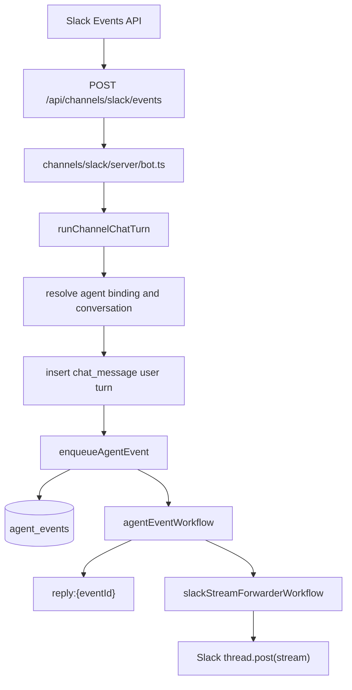

# Slack Integration

Slack is a realtime ingress channel for agents. It uses Vercel Chat SDK for
Slack transport and the app's canonical `agent_events` queue for durable
execution, idempotency, retry, and same-thread ordering.

## Runtime Flow



The Slack webhook path only validates, routes, persists the user message, and
enqueues work. Long model/tool execution happens in Vercel Workflow after the
webhook acknowledgement is already returned to Slack.

## Event Keys

Slack events use stable primitive ids in the `agent_events` payload:

- `teamId`
- `channelId`
- `threadTs`
- `messageTs`

The canonical idempotency key is:

```txt
slack:{teamId}:{channelId}:{messageTs}:{agentId}
```

The same-thread concurrency key is:

```txt
slack:{teamId}:{channelId}:{threadTs}:{agentId}
```

This means duplicate delivery of the same Slack message reuses the same event,
while two different Slack threads for the same agent can run concurrently.
If a second message arrives in the same Slack thread while the first event is
`starting` or `running`, the new event remains `queued` and Slack gets a short
queued acknowledgement.

## Streaming

Slack streaming is handled by
`channels/slack/server/stream-forwarder-workflow.ts`.

The agent workflow writes UI message chunks to the event namespace:

```txt
reply:{eventId}
```

The forwarder workflow reconstructs the Slack thread from `teamId`,
`channelId`, and `threadTs`, reads the workflow namespace, converts text deltas
to an async text stream, and passes that stream to Chat SDK's
`thread.post(...)`.

The event payload intentionally stores Slack primitives rather than serialized
Chat SDK `Thread` objects. That keeps retries, idempotency, and database
inspection simple and avoids coupling durable payloads to adapter internals.

## Database

Slack routing uses these tables:

- `channel_installations`: encrypted bot token and workspace metadata per user.
- `agent_channel_bindings`: user-scoped routing from Slack channel or DM to an
  agent.
- `channel_thread_conversations`: mapping from Slack thread to app
  `chat_conversation`.
- `agent_events`: durable event ledger for execution, queueing, streaming, and
  liveness.

The dispatcher resolves agents under the installing user's `userId`, so two
users can install the same Slack workspace and bind the same Slack channel to
different personal agents without crossing ownership boundaries.

## Chat SDK State

The Slack bot uses `SlackHybridState`:

- Slack installation records are persisted in Postgres with encrypted tokens.
- Chat SDK ephemeral state uses Redis when `REDIS_URL` is set.
- Without `REDIS_URL`, the fallback is in-memory state for local development.

This Chat SDK state is separate from the Upstash Redis REST client used by the
event scheduler lock and file cache.

## Environment Variables

```bash
SLACK_CLIENT_ID=...
SLACK_CLIENT_SECRET=...
SLACK_SIGNING_SECRET=...
SLACK_BOT_USERNAME=assistant

# Optional Chat SDK state backend.
REDIS_URL=redis://...
```

`CONNECTION_ENCRYPTION_KEY` is also required by the app and is reused to encrypt
Slack bot tokens at rest.

## Operational Notes

- Chat SDK handler concurrency can protect ingress, but it is not the canonical
  queue. The queue of record is `agent_events`.
- Slack requires a fast webhook acknowledgement. The route uses background work
  so a Slack-triggered event can run for much longer than the request.
- Retry logic must not fail a Slack event just because it has been running for a
  long time. Liveness is based on workflow terminal status and stale
  `heartbeatAt`.
- `enabled=false` prevents new Slack events from being scheduled for the agent.

## Adding Another Channel

Another channel should reuse the same pattern:

1. Add a Chat SDK adapter and webhook route.
2. Persist the inbound user message into `chat_message`.
3. Enqueue `agent_events` with a source-specific `idempotencyKey`.
4. Use a narrow `concurrencyKey` only where ordering is required.
5. Forward `reply:{eventId}` to the channel from a separate publisher workflow
   when the channel needs long-lived streaming outside the webhook.
