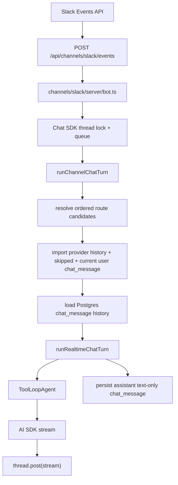

# Slack Integration

Slack is a realtime ingress channel for agents. It uses Vercel Chat SDK for
Slack transport, queueing, thread locking, and streaming replies. Agent
execution does not go through `agent_events`; Slack turns run through the
realtime `ToolLoopAgent` runner and persist visible state in `chat_message`.

## Runtime Flow



The Slack webhook route acknowledges quickly and lets Chat SDK continue work via
`waitUntil`. Inside a single Chat SDK handler, multi-agent fan-out is sequential:
agents are never run in parallel for the same inbound Slack message.

## Routing Order

Routing returns ordered route objects, not just bare agents. Final ordering is:

1. `installation.createdAt ASC`
2. `installation.userId ASC`
3. `agent.id ASC`

This keeps multi-agent fan-out deterministic across retries and deploys.

## Idempotency

Chat SDK handles short-lived webhook dedupe, but transcript dedupe is enforced
in Postgres. Each Slack user message id is deterministic per agent:

```txt
rawKey = [channel, externalScopeId, externalMessageKey, agentId].join('\u0000')
id = `msg_${sha256(rawKey).base64url.slice(0, 16)}`
```

`externalScopeId` is the Slack team id. `externalMessageKey` is Chat SDK's
provider-normalized `message.id`.

User messages are upserted because provider-authored messages can be edited.
If the current Slack message is unchanged and already exists for that agent,
the runner is skipped. Messages supplied by Chat SDK as `context.skipped` are
imported before the current message so the transcript keeps all user turns from
a rapid burst. Missing messages in provider history are not treated as deletes.

## Chat SDK State

The Slack bot uses `SlackHybridState`:

- `slack:installation:*` keys are intercepted and stored in Postgres so OAuth
  installations stay owner-scoped and encrypted.
- All other Chat SDK state goes to Redis: locks, queues, dedupe,
  subscriptions, and ephemeral state.
- `REDIS_URL` is required in every environment. There is no memory fallback.

Chat SDK concurrency is configured as `queue`. While one handler is running,
only the latest queued message is processed next; intermediate messages arrive
as `context.skipped`.

## Streaming And Persistence

Slack receives AI SDK `result.stream` through Chat SDK `thread.post(...)`.
The runner wraps the stream with `tapFullStream`, a single-consumer async
generator that:

- accumulates visible `text-delta` chunks for text-only persistence;
- yields original chunks unchanged to Chat SDK;
- avoids `ReadableStream.tee()` and double consumption.

If `thread.post(...)` throws, the partial accumulator is not persisted. The
error is logged and rethrown so Chat SDK releases its lock through its normal
error path.

Assistant delivery has no v1 reconciliation ledger. The runner persists the
assistant text only after `thread.post(...)` completes. A provider-delivered
assistant message can be missing from Postgres only if the process dies in the
small window after delivery and before final persistence; that residual risk is
accepted until incidents justify a delivery ledger.

Budget refusal posts a plain text notice and persists an assistant text-only
message without starting sandbox, model, or usage work. Step-limit notices are
posted as a follow-up message and appended to the persisted assistant text.

## Environment Variables

```bash
SLACK_CLIENT_ID=...
SLACK_CLIENT_SECRET=...
SLACK_SIGNING_SECRET=...
SLACK_BOT_USERNAME=assistant
REDIS_URL=redis://...
```

`CONNECTION_ENCRYPTION_KEY` is also required by the app and is reused to encrypt
Slack bot tokens at rest.

## Adding Another Channel

Another realtime channel should reuse the same pattern:

1. Add a Chat SDK adapter and webhook route.
2. Normalize inbound events into `IncomingChannelTurn`.
3. Import provider history as best-effort user messages.
4. Persist skipped and current user turns with deterministic ids.
5. Load model context from Postgres `chat_message`.
6. Resolve ordered route objects and run agents sequentially.
7. Stream AI SDK `stream` through the channel adapter.
8. Persist the assistant transcript in the channel-specific format.
